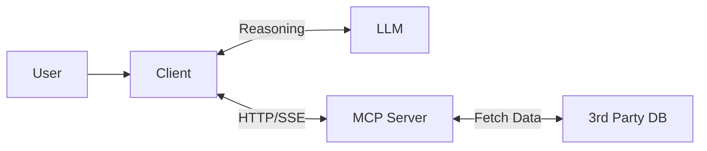

# MCP Server

```sh
docker build -t mcp-rag-server .
docker run -p 8000:8000 mcp-rag-server

curl -N http://localhost:8000/sse

uv run client_example.py
```


```mermaid
flowchart LR
    User --> Client
    Client <-->|Reasoning| LLM
    Client <-->|HTTP/SSE| MCP[MCP Server]
    MCP <-->|Fetch Data| DB[3rd Party DB]
```
