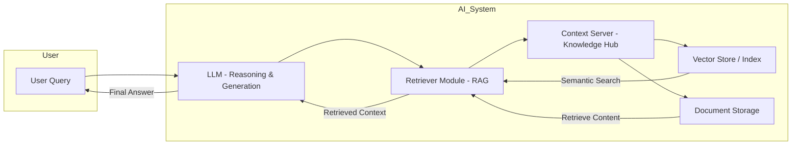

# AI

Artificial Intelligence (AI) is the broader field focused on creating systems that can perform tasks that typically require human intelligence.

- Scope: reasoning, learning, perception, decision-making, creativity.
- Subfields: machine learning, deep learning, robotics, computer vision, NLP, reinforcement learning.
- Key point: LLMs are a subset of AI, specifically in the natural language processing (NLP) space, built with deep learning methods.

LLMs are neural networks trained to process and generate human language at scale. They’re called “large” because they have billions to trillions of parameters and are trained on massive datasets on a diverse range of topics to help the models generalize on unseen questions.

- More parameters means the model can store and represent more complex patterns from data.
- A larger parameter count lets the network model subtle language patterns, context, tone, and reasoning.
- It uses patterns from its weights plus the current context window to predict output.
- But, larger doesn’t always mean better - past a point, it’s costly in compute, memory, and energy.

RAG is about giving the LLM access to more information - which it might not have been trained or built on. MCP is about giving it the capability to interact with and take action on external systems autonomously in real time as it answers requests.

## Diagram



## What happens when you send a request

When you call an API (e.g., `POST /chat/completions`), here’s the conceptual pipeline:

a. API Gateway Layer

- You send JSON like:

  ```json
  {
    "user_id": "12345",
    "input_text": "Write me a short poem about penguins"
  }
  ```

- The request first hits an API gateway (think Nginx, Envoy, API Gateway services).
- Handles authentication, rate limiting, and logging.

b. Orchestration Layer

- Decides _which GPU worker node_ will handle the request.
- May batch multiple user prompts together to run in parallel on the GPU to increase throughput.
- Ensures context length fits the model’s maximum window.

c. Preprocessing

- Converts the raw input text into tokens using the model’s tokenizer.
- Builds the prompt — which could include:

  - Your input text
  - System messages (instructions on style/tone)
  - Retrieved context (if RAG is in use)
  - Chat history if needed

d. Inference Execution

- Tokens are fed into the neural network forward pass.
- The GPU(s) run the transformer layers, using the trained parameters to predict the next token over and over until the stopping condition is reached.
- Decoding strategy (greedy, top-p sampling, beam search) determines which token gets picked at each step.

e. Postprocessing

- Tokens are converted back to text.
- May run content filtering or moderation checks.
- Formats the response for the API.

f. Response Returned

- Sent back through the gateway to you.

---

### General Workflow

#### 1. Training Data

- Source types:

  - Public web pages (Wikipedia, news articles, forums, books).
  - Licensed datasets.
  - Proprietary corporate data.

- Preprocessing:

  - Tokenization -> convert raw text into numerical tokens.
  - Cleaning -> remove duplicates, harmful or nonsensical text.
  - Balancing -> ensuring a mix of topics and styles.

#### 2. Neural Network Architecture

- Transformer model is the backbone:

  - Encoder: understands input context (not always used in decoder-only LLMs).
  - Decoder: predicts the next token based on context.
  - Self-attention: lets the model weigh the importance of each token relative to others in the sequence.

- Parameters: learned weights that determine how input signals are transformed into output predictions.

#### 3. Training Process

- Objective: usually next-token prediction (causal language modeling).
- Steps:

  1. Input a sequence of tokens.
  2. Model predicts the next token.
  3. Compare prediction to the actual next token -> calculate loss.
  4. Adjust weights via backpropagation using gradient descent.
  5. Repeat for billions/trillions of examples.

- Infrastructure: multi-GPU/TPU clusters, distributed training frameworks, high-throughput data pipelines.

#### 4. Iteration & Refinement

- Pretraining: learn general language patterns.
- Fine-tuning: adapt to specific tasks or domains.
- RLHF (Reinforcement Learning with Human Feedback): improve alignment with user expectations by ranking outputs and adjusting behavior.

#### 5. Inference (Usage)

- Prompt goes in -> tokenized -> passed through the network -> output tokens are generated via decoding strategy (greedy, sampling, beam search).
- Post-processing can include formatting, filtering, or grounding in external knowledge.

---

## Retrieval-Augmented Generation (RAG)

RAG is a read-only technique that enhances LLMs by letting them look up relevant information before generating an answer, instead of relying solely on what was learned during training.

- Example: A chatbot on an e-commerce site that explains "What are the return policies for electronics?" or "How do I troubleshoot common printer issues?"

- LLMs have a fixed “knowledge cutoff” after training.
- Without RAG, they can’t learn new facts unless retrained.
- RAG lets you keep responses up-to-date without touching the model weights.

Workflow:

1. User Query -> “Who won the 2025 NBA Finals?”
2. Retriever Module searches a database, vector store (like Pinecone, Weaviate, Milvus), or the internet for relevant documents.
3. Top results are passed into the LLM as additional context in the prompt.
4. LLM uses both its internal knowledge + retrieved context to generate the answer.

Key components:

- Vector embeddings: turn text/documents into dense vectors to enable semantic search.
- Similarity search: find the closest matching documents to the query.
- Prompt templating: insert retrieved info into the LLM’s input.

Benefits:

- No retraining required.
- Domain-specific adaptation (e.g., private company documents).
- Reduces hallucinations if retrieval is accurate.
- Allows LLM to provide proof of where it got its answer from

---

## Model Context Protocol

Model Context Protocol is an open, standardized protocol introduced by Anthropic in November 2024 designed to let AI systems, particularly large language models, communicate with external tools and data sources in a unified way. It uses a client-server model built on JSON-RPC 2.0 and supports various transport modes like stdio, HTTP, and server-sent events.

- MCP is about making an LLM more capable and autonomous by giving it a standardized way to take action.
- Example: LLM could use RAG to retrieve a customer's recent order details from a knowledge base. Then, it could use an MCP call to update that order's status in a live e-commerce system.

* Think of it as a “USB-C for AI apps”: a universal connector enabling models to access functions, databases, files, APIs without building custom integrations each time.
* It’s already supported by major players like OpenAI, Google DeepMind, and Microsoft, which sees it as laying the groundwork for an "agentic web" where AI agents interact seamlessly with applications
* Despite its promise, MCP carries security concerns, especially regarding prompt injection and unauthorized tool access, which researchers are actively investigating and mitigating.

MCPs can be written in Python, Go etc but instead of exposing HTTP endpoints, they expose capabiltiies in specific JSON-RPC like format so that the LLM can:

1. See functions the MCP offers
2. Call those funcdtions by passing in arguments in a standardized way
3. Receive structured responses that the LLM can interpret

## Examples

### Example 1 — Chatbot for your company’s internal documentation site

Goal: When employees ask “How do I request PTO?” or “What’s the onboarding process?”, the chatbot answers from the latest internal documentation.

### Example 2 - Company writing an MCP to interact w/ Jira and make Tickets

1. You (the company) write an MCP server that wraps around Jira's existing REST API
2. Your MCP server exposes capabilities like `create_ticket`, `update_ticket`, `search_issues` in the standardized JSON-RPC format
3. Your LLM (Claude, GPT, etc.) can then discover and call these functions through the MCP protocol
4. The MCP server translates those calls into actual Jira API requests

You could even go further:

- "Show me all P0 bugs assigned to Sarah"
- "Update ticket ABC-123 to mark it as resolved"
- "Add a comment to ticket XYZ-456 saying we need more info from QA"

#### RAG

- You’d use RAG so the model can pull answers from the _most recent_ documentation without retraining.
- Flow:

  1. User asks a question.
  2. RAG retrieves relevant doc snippets from your documentation search index.
  3. Pass those snippets into the LLM’s prompt.
  4. LLM answers in natural language.

- Why: Company policies change - you don’t want to retrain every time.

#### Context Server

- You might build or use a context server to store and serve that documentation:

  - Stores document text (HTML, markdown, PDF extractions).
  - Generates embeddings and stores them in a vector database (e.g., Pinecone, Weaviate, Milvus, pgvector).
  - Supports semantic search so the chatbot can fetch relevant chunks.

- Why: The context server is the _actual backend infrastructure_ that RAG queries against.

#### MCP

- Not required if all you need is doc search, but could be helpful if:

  - You want the LLM to do more than answer questions — e.g., open a ticket, send an HR email, or update a doc.
  - You want to plug into multiple internal tools (Notion, Jira, Slack) without building custom integrations for each.

- Why: MCP standardizes how the LLM talks to different company services.

---

### Example 2 — Let ChatGPT answer company questions using data from Notion

Goal:
Inside ChatGPT (or another LLM app), an employee can ask, “Show me the Q3 project roadmap from our Notion” and get a direct, accurate answer.

Where the three concepts fit in:

#### RAG

- Use RAG so ChatGPT can _retrieve_ the latest Notion pages at request time.
- Avoids fine-tuning ChatGPT with Notion data (which is costly and static).

#### Context Server

- This would:

  - Connect to Notion’s API.
  - Pull down pages, sync updates regularly.
  - Chunk text, create embeddings, store in a vector index.
  - Serve chunks to the LLM when asked a question.

- Without a context server, you’d have to hit Notion’s API live for every query, which can be slow or API-limited.

#### MCP

- This is where MCP shines:

  - Instead of building your own Notion integration for every LLM product, you create an MCP connector.
  - Any MCP-compatible LLM (Claude, ChatGPT, etc.) can now talk to your Notion connector.
  - The connector could:

    - Fetch a Notion page.
    - Search Notion databases.
    - Update entries if needed.

- Why: MCP turns this into a plug-and-play integration, rather than building a custom RAG pipeline per app.

---

## How an LLM Generates a Response

Input: "The capital of France is": ...

### STEP 1: Tokenization

What happens:

- Split the input text into tokens
- "The" -> token ID 123
- "capital" -> token ID 456
- "of" -> token ID 789
- "France" -> token ID 1011
- "is" -> token ID 1213

Why we do this:

- Computers can't process raw text - they need numbers
- Standardizes input: Different ways to write the same thing (capitalization, spacing) map to consistent tokens
- Efficient processing: Breaking text into subword units (tokens) balances vocabulary size with flexibility - the model can handle any word, even ones it's never seen, by combining token pieces
- Example: "unbelievable" might be ["un", "believ", "able"] if it wasn't in training data

---

### STEP 2: Convert tokens to embeddings

What happens:

- Each token ID gets converted to a vector (a list of numbers)
- Example: token 123 -> [0.2, 0.5, 0.8, 0.1, ... 12,288 numbers]
- These embeddings capture the "meaning" of each token

Why we do this:

- Token IDs are arbitrary: ID 123 vs ID 456 have no inherent mathematical relationship
- Embeddings encode meaning: Words with similar meanings get similar vectors. "king" and "queen" will have nearby vectors in this high-dimensional space
- Enables mathematical operations: You can do math on meanings (famous example: "king" - "man" + "woman" ≈ "queen")
- Learned during training: The model learns what numbers best represent each token's meaning through exposure to billions of text examples

---

### STEP 3: Process through the model layers

Why we do this overall:

- To understand context and relationships between all the words
- To transform the input into a representation that can predict what should come next
- Each layer refines understanding, going from simple patterns to complex reasoning

---

#### 3a. Self-attention mechanism

What happens:

- Look at ALL input tokens and compute how related they are to each other
- "France" pays high attention to "capital" (they're related)
- "is" pays attention to the whole phrase to understand context
- This produces a new representation for each token based on context

Why we do this:

- Words mean different things in different contexts: "bank" near "river" vs "bank" near "money"
- Captures long-range dependencies: "France" at position 4 is crucial for understanding what comes after "is" at position 5, even though they're not adjacent
- Parallel processing: Unlike older models (RNNs), attention lets us look at all words simultaneously rather than sequentially
- This is the "magic" of transformers: The model figures out which words should "pay attention" to which other words to understand meaning

---

#### 3b. Feed-forward neural network (matrix multiplication)

What happens:

- Take the attention output and run it through multiple layers
- Each layer multiplies the data by the model's learned weights (parameters)
- Layer 1: multiply by weight matrix #1
- Layer 2: multiply by weight matrix #2
- ... repeat for 80+ layers (depending on model size)

Why we do this:

- Transform and refine: Each layer extracts increasingly abstract patterns
  - Early layers: Basic syntax and word relationships
  - Middle layers: Grammar, facts, entities
  - Later layers: Complex reasoning, logical inference
- The weights are the "knowledge": These billions of parameters encode everything the model learned during training (grammar rules, facts about the world, reasoning patterns)
- Non-linear transformations: Simple matrix math couldn't capture complex patterns; multiple layers with activation functions let the model learn any function
- More layers = more sophisticated reasoning: Deeper models can handle more complex logic and nuance

This is the most critical part of the process. It's basically simulating a human brain and applying billions of learned patterns about language, facts, and reasoning to understand the input and predict what should come next.

- A human brain has billions of neurons connected together
- A neural network has billions of parameters (weights) in matrices

---

#### 3c. Output probabilities

What happens:

- After all layers, you get a probability distribution over ALL possible next tokens (~50,000-100,000 possible tokens)
- "Paris" -> 82% probability
- "London" -> 3% probability
- "the" -> 1% probability
- ... etc.

Why we do this:

- Convert internal representation to actionable output: The model's internal vectors need to be transformed into actual token predictions
- Probability distribution captures uncertainty: The model is never 100% certain - it hedges its bets across likely options
- Enables sampling strategies: We can pick the most likely token (greedy), or sample from the distribution to get more creative/varied responses
- Trained to maximize correct predictions: During training, the model learns to assign high probabilities to correct next tokens

---

### STEP 4: Select the next token

What happens:

- Pick the highest probability token (or sample from the distribution)
- Selected: "Paris"

Why we do this:

- Convert probabilities into actual output: We need to commit to one token to continue
- Different strategies for different goals:
  - Greedy (pick highest): Most predictable, factual responses
  - Sampling: More creative, varied responses (used for creative writing)
  - Temperature: Controls randomness - low temp = safer, high temp = more creative

---

### STEP 5: Add the new token to the sequence

What happens:

- Original: "The capital of France is"
- Updated: "The capital of France is Paris"

Why we do this:

- Build the response incrementally: Each new token extends the conversation
- Context for the next prediction: The model needs to see "Paris" when deciding what comes next (probably punctuation)
- Autoregressive generation: Each token depends on all previous tokens - this is why generation is sequential

---

### STEP 6: Repeat steps 3-5 for the next token

What happens:

- Now the input is "The capital of France is Paris"
- Run through the model again
- Get probabilities for the next token
- Selected: "." (period)
- Updated: "The capital of France is Paris."

Why we do this:

- Generate complete, coherent responses: One token isn't enough - we need full sentences
- Each token adds context: "Paris" makes it clear we're done with the answer, so punctuation is now most likely
- Maintains consistency: By always feeding back the full sequence, the model remembers what it's already said

---

### STEP 7: Stop when complete

What happens:

- Continue until hitting a stop token, max length, or natural ending
- Return the final response

Why we do this:

- Prevent infinite generation: Without a stopping condition, the model would keep generating forever
- Stop tokens signal completion: Special tokens like `<|endoftext|>` tell the model "I'm done"
- Max length prevents runaway: Safety mechanism if the model doesn't naturally stop
- Natural endings: Model learns to end sentences/paragraphs appropriately through training

---

### Key Insight:

Every step is about transforming human language into math the computer can process (steps 1-2), understanding the meaning and context (step 3), and generating the most likely continuation (steps 4-7). The billions of parameters in steps 3a-3b are where all the "intelligence" lives - they encode patterns learned from training on massive text datasets.
