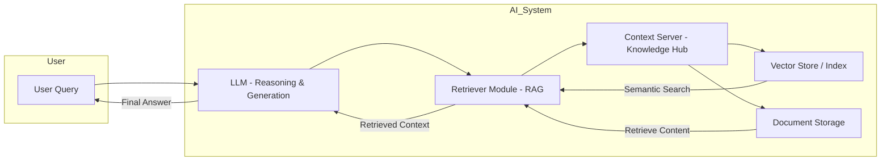

# AI

Artificial Intelligence (AI) is the broader field focused on creating systems that can perform tasks that typically require human intelligence.

- Scope: reasoning, learning, perception, decision-making, creativity.
- Subfields: machine learning, deep learning, robotics, computer vision, NLP, reinforcement learning.
- Key point: LLMs are a subset of AI, specifically in the natural language processing (NLP) space, built with deep learning methods.

LLMs are neural networks trained to process and generate human language at scale. They’re called “large” because they have billions to trillions of parameters and are trained on massive datasets on a diverse range of topics to help the models generalize on unseen questions.

- More parameters means the model can store and represent more complex patterns from data.
- A larger parameter count lets the network model subtle language patterns, context, tone, and reasoning.
- It uses patterns from its weights plus the current context window to predict output.
- But, larger doesn’t always mean better - past a point, it’s costly in compute, memory, and energy.

RAG is about giving the LLM access to more information - which it might not have been trained or built on. MCP is about giving it the capability to interact with and take action on external systems autonomously in real time as it answers requests.

## Diagram



## What happens when you send a request

When you call an API (e.g., `POST /chat/completions`), here’s the conceptual pipeline:

a. API Gateway Layer

- You send JSON like:

  ```json
  {
    "user_id": "12345",
    "input_text": "Write me a short poem about penguins"
  }
  ```

- The request first hits an API gateway (think Nginx, Envoy, API Gateway services).
- Handles authentication, rate limiting, and logging.

b. Orchestration Layer

- Decides _which GPU worker node_ will handle the request.
- May batch multiple user prompts together to run in parallel on the GPU to increase throughput.
- Ensures context length fits the model’s maximum window.

c. Preprocessing

- Converts the raw input text into tokens using the model’s tokenizer.
- Builds the prompt — which could include:

  - Your input text
  - System messages (instructions on style/tone)
  - Retrieved context (if RAG is in use)
  - Chat history if needed

d. Inference Execution

- Tokens are fed into the neural network forward pass.
- The GPU(s) run the transformer layers, using the trained parameters to predict the next token over and over until the stopping condition is reached.
- Decoding strategy (greedy, top-p sampling, beam search) determines which token gets picked at each step.

e. Postprocessing

- Tokens are converted back to text.
- May run content filtering or moderation checks.
- Formats the response for the API.

f. Response Returned

- Sent back through the gateway to you.

---

### General Workflow

#### 1. Training Data

- Source types:

  - Public web pages (Wikipedia, news articles, forums, books).
  - Licensed datasets.
  - Proprietary corporate data.

- Preprocessing:

  - Tokenization -> convert raw text into numerical tokens.
  - Cleaning -> remove duplicates, harmful or nonsensical text.
  - Balancing -> ensuring a mix of topics and styles.

#### 2. Neural Network Architecture

- Transformer model is the backbone:

  - Encoder: understands input context (not always used in decoder-only LLMs).
  - Decoder: predicts the next token based on context.
  - Self-attention: lets the model weigh the importance of each token relative to others in the sequence.

- Parameters: learned weights that determine how input signals are transformed into output predictions.

#### 3. Training Process

- Objective: usually next-token prediction (causal language modeling).
- Steps:

  1. Input a sequence of tokens.
  2. Model predicts the next token.
  3. Compare prediction to the actual next token -> calculate loss.
  4. Adjust weights via backpropagation using gradient descent.
  5. Repeat for billions/trillions of examples.

- Infrastructure: multi-GPU/TPU clusters, distributed training frameworks, high-throughput data pipelines.

#### 4. Iteration & Refinement

- Pretraining: learn general language patterns.
- Fine-tuning: adapt to specific tasks or domains.
- RLHF (Reinforcement Learning with Human Feedback): improve alignment with user expectations by ranking outputs and adjusting behavior.

#### 5. Inference (Usage)

- Prompt goes in -> tokenized -> passed through the network -> output tokens are generated via decoding strategy (greedy, sampling, beam search).
- Post-processing can include formatting, filtering, or grounding in external knowledge.

---
