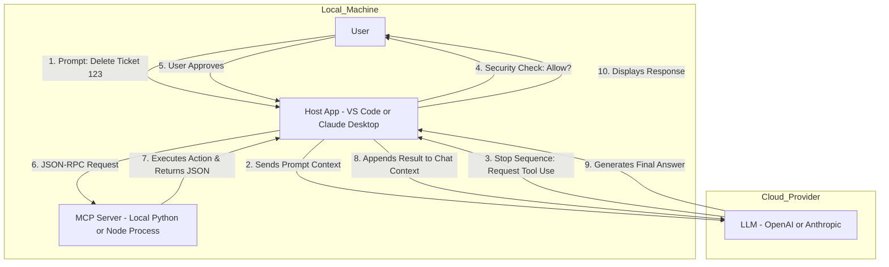

# Model Context Protocol (MCP)

MCP is an open standard (introduced by Anthropic, Nov 2024) that acts as a "Universal USB-C Port" for AI. It allows LLMs to connect to external data and tools without needing custom integrations for every single application.

The Core Concept: Instead of the LLM directly connecting to some 3rd party system like a database or service (which is insecure and technically difficult), the Host Application (VS Code, Claude Desktop) acts as the bridge.

### The Architecture: Who calls whom?

It is critical to understand that the LLM does not execute code. The Host does the work.

1. Discovery: The Host App connects to your MCP Server and asks, "What tools do you have?" The Server replies: "I have `get_ticket` and `delete_ticket`."
1. The Prompt: The User asks the LLM: "Delete ticket 123."
1. The Decision (LLM): The LLM analyzes the text. It pauses generation and sends a structured request to the Host: _"Please run the tool `delete_ticket` with argument `123`."_
1. The Execution (Host): The Host App receives this request. It connects to the MCP Server and executes the function.
1. The Return (MCP): The MCP Server runs the logic (e.g., deletes the row in SQL) and returns a JSON result (e.g., `{"status": "success"}`).
1. Context Injection (Host): The Host takes that JSON and pastes it back into the chat context as a "Tool Result."
1. Final Answer (LLM): The LLM reads the result and generates the final natural language response: _"I have successfully deleted ticket 123."_

### The Primitives: Resources vs. Tools

MCP Servers expose two main types of capabilities:

| Type | Analogy | Direction | Use Case |
| :-------- | :---------------- | :------------ | :---------------------------------------------------------------------------------------------------------- |
| Resources | "The File Reader" | Server -> LLM | Read-Only Data. Fetching logs, reading API docs, getting the content of a file. Used for providing context. |
| Tools | "The Robot Arm" | LLM -> Server | Executable Actions. API POST requests, database writes, strictly defined functions with side effects. |

### Why JSON-RPC? (The Protocol)

MCP separates the _transport_ (HTTP/SSE) from the _message_ (JSON-RPC).

- Stateless & Async: JSON-RPC 2.0 allows requests and responses to be matched via an `id` field, essential for AI where generation takes time.
- The Payload: The LLM never sees the raw Python/Go code. It only sees the JSON schema.

Example Payload (Host -> MCP Server):

```json
{
  "jsonrpc": "2.0",
  "method": "tools/call",
  "params": {
    "name": "create_jira_ticket",
    "arguments": { "title": "Bug in UI", "priority": "High" }
  },
  "id": 1
}
```

### The "Universal Plugin" Analogy

You build the MCP Server once, and it works in any Host.

- The Host (Browser/OS): Claude Desktop, Cursor, VS Code.
- The Plugin (MCP Server): Your Python script connected to Postgres.
- The Config: A simple JSON file (`claude_desktop_config.json`) telling the Host where to find the local script.

### Flow Diagram

The MCP Flow involves multiple roundtrips between the User, Host App, LLM, and MCP Server:

- There's a tradeoff here between latency and security and capability.
- We don't want the LLM to have direct access to our database systems or third party APIs.
- We don't want the LLM to have network access to our internal MCP Servers.
- We workaround this by having the Host App (which is on the user's client) handle all of these MCP Server interactions, and it just returns the results to the LLM as additional context.



### Production Hosting

MCP Servers can be hosted like any other microservice in your infrastructure.

- They can run on AWS Lambda, Google Cloud Run, or your own Kubernetes cluster.

The only caveat is that the Host App (e.g., Claude Desktop) needs network access to reach the MCP Server endpoint.

- This is typically done via VPN, API Keys, or OAuth authentication.

### RAG \<> MCP

Before MCP, RAG pipelines were typically hard-coded scripts that combined retrieval and generation in a single monolithic function. MCP allows more modular and flexible RAG implementations by exposing retrieval functions as MCP Resources or Tools.

- The LLM can decide _when_ to call the retrieval tool based on the prompt.

Not all MCPs are RAG systems. For example, an MCP Server could expose tools for database writes or API calls that don't involve retrieval or data augmentation at all.

Summary of the distinction:

- RAG MCP Server: "I found these 3 documents about Project X." (Resource - data augmentation)
- Tool Action MCP Server: "I just deleted Ticket #1734." (Tool - action execution)

### The "Context Pollution" Problem

Every tool you add is not just a "capability"—it is also text.

- Token Cost: To an LLM, a tool definition is just a paragraph of JSON in the System Prompt. If you have 500 tools, you might be filling 50k tokens just to _introduce_ yourself. You pay for those tokens on every single turn.
- Attention Degradation: LLMs have "attention heads." The more tools you give them, the harder it is for the model to pick the right one.
  - _Scenario:_ If you have `delete_ticket` (Jira), `delete_row` (SQL), and `delete_file` (S3), and the user says "Delete it," the model is more likely to hallucinate or pick the wrong one if it is overwhelmed.

The Magic Number: Current best practices suggest keeping an active toolset to under 10–20 tools for maximum reliability.

### The Solution: "The Toolbox Strategy"

Instead of one giant "God Mode" MCP server, you should build Task-Specific MCP Servers (what you called "separate use cases") where you apply the Principle of Least Privilege to your AI architecture.

You effectively create different "personas" for your AI by enabling different plugins.

For example:

- Customer Support Agent: An MCP Server with RAG capabilities for serving information from internal knowledge bases.
- Database Admin Agent: An MCP Server with tools for querying database status, running backups, and monitoring performance.
- Don't make 1 MCP Server that does everything. Make 3–5 specialized MCP Servers that each do one job well, and force your AI microservices to only have access to the MCP Server they need for the task at hand.
