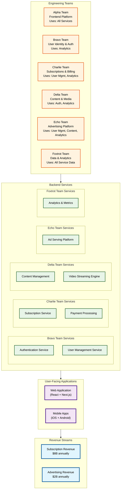
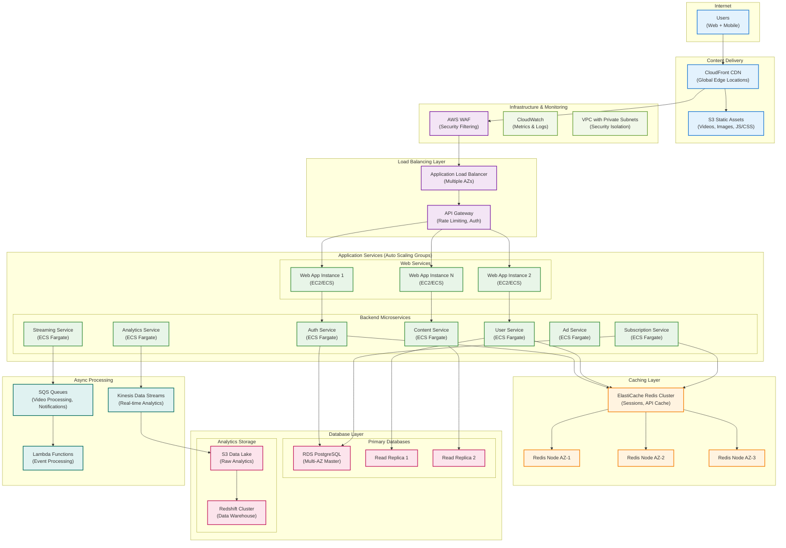

# Org Chart

Sample Org Chart for a Tech Company

## Overview

StreamFlix is a video streaming platform with 50M subscribers generating $10B annual revenue through subscriptions ($8B) and advertising ($2B). Our engineering organization consists of 6 teams supporting 2 user-facing applications and 8 backend services.

## Team Overview

## Alpha Team - Frontend Platform

Mission: Deliver exceptional user experiences across all client applications

### Responsibilities

- Web application (React/Next.js) development and maintenance
- Mobile applications (iOS/Android) development and maintenance
- Frontend performance optimization and A/B testing
- User interface consistency and design system implementation
- Client-side analytics and user behavior tracking

### Team Composition

- Team Lead
- 2 Senior Frontend Engineers
- 2 Mobile Engineers
- Product Designer
- Product Manager

### Key Metrics

- User conversion rates
- Application load times
- Mobile app store ratings
- Frontend error rates

---

## Bravo Team - DevOps, Infrastructure & SRE

Mission: Ensure reliable, scalable, and secure infrastructure for all platform services

### Responsibilities

- Infrastructure as Code (Terraform, CloudFormation, Kubernetes)
- CI/CD pipeline management and deployment automation
- Service reliability engineering and incident response
- Infrastructure monitoring, alerting, and observability
- Security infrastructure and compliance tooling
- Cost optimization and resource management
- Database administration and backup strategies
- Network architecture and load balancing

### Team Composition

- Team Lead
- 3 Senior SRE Engineers

### Key Metrics

- Platform uptime (99.99% SLA)
- Deployment success rate
- Mean time to recovery (MTTR)
- Infrastructure cost efficiency
- Security incident response time

### Services Supported

- All teams' infrastructure needs
- Shared monitoring and alerting systems
- Deployment pipelines for all services
- Security scanning and compliance tools

---

## Charlie Team - Subscriptions & Billing

Mission: Drive subscription revenue through reliable billing and payment systems

### Responsibilities

- Subscription service (plan management, billing cycles, upgrades/downgrades)
- Payment processing (credit cards, PayPal, international payments)
- Revenue optimization (pricing experiments, retention campaigns)
- Financial reporting and subscription analytics
- Payment compliance (PCI DSS, international regulations)

### Team Composition

- Team Lead
- 3 Senior Backend Engineers
- Data Engineer
- Product Manager

### Key Metrics

- Monthly recurring revenue (MRR)
- Payment failure rates
- Subscription churn rates
- Revenue per user (ARPU)

---

## Delta Team - Content & Media

Mission: Deliver high-quality content streaming experiences at global scale

### Responsibilities

- Content management system (metadata, catalogs, search)
- Video streaming engine (transcoding, CDN optimization, adaptive bitrate)
- Content recommendation algorithms
- Video quality monitoring and optimization
- Content ingestion and processing pipelines

### Team Composition

- Team Lead
- 3 Senior Backend Engineers
- 2 Data Scientists
- Product Manager

### Key Metrics

- Video start success rates
- Streaming quality scores
- Content discovery engagement
- CDN cache hit rates

---

## Echo Team - Advertising Platform

Mission: Maximize advertising revenue while maintaining user experience quality

### Responsibilities

- Ad serving platform (targeting, bidding, inventory management)
- Ad performance tracking and optimization
- Advertiser dashboard and self-service tools
- Ad quality and content safety filtering
- Revenue optimization and yield management

### Team Composition

- Team Lead: Victoria Singh (Principal Engineer)
- Backend Engineers: Christopher Lee, Natasha Volkov
- Ad Tech Engineer: Benjamin Clark
- Data Scientist: Dr. Maria Gonzalez
- Product Manager: Andrew Mitchell

### Key Metrics

- Ad revenue per user
- Ad completion rates
- Advertiser satisfaction scores
- Ad loading performance

---

## Foxtrot Team - Data & Analytics

Mission: Enable data-driven decisions across all business functions

### Responsibilities

- Analytics and metrics service (data collection, processing, reporting)
- Data pipeline architecture and ETL processes
- Business intelligence dashboards and reporting
- Machine learning platform and model deployment
- Data quality monitoring and governance

### Team Composition

- Team Lead
- 2 Data Engineers
- 2 Analytics Engineer
- ML Platform Engineer
- Product Manager: Michelle Davis

### Key Metrics

- Data pipeline reliability
- Query performance and availability
- Model prediction accuracy
- Business metric reporting SLA

---

## Cross-Team Responsibilities

### On-Call Rotation

Each team maintains 24/7 on-call coverage for their services with escalation procedures to team leads and principal engineers.

### Quarterly Business Reviews

Teams present service performance, business impact metrics, and roadmap alignment to executive leadership.

### Inter-Team Dependencies

- Alpha Team integrates with all backend services
- Foxtrot Team receives data from all other teams
- Security and compliance requirements span all teams

### Shared Infrastructure

- All teams contribute to shared libraries and platform services
- Common deployment pipelines and monitoring standards
- Shared documentation and knowledge base maintenance

---

## Revenue Impact Mapping

### Subscription Revenue ($8B)

- Primary: Charlie Team (billing optimization)
- Secondary: Alpha Team (conversion), Delta Team (content satisfaction)

### Advertising Revenue ($2B)

- Primary: Echo Team (ad platform optimization)
- Secondary: Alpha Team (ad integration), Delta Team (content context), Foxtrot Team (targeting data)

### Cost Optimization

- Infrastructure: Bravo Team (cloud costs, resource efficiency, scaling optimization)
- Operations: Bravo Team (platform reliability, reduced downtime costs), All teams (service reliability)

## Architecture

