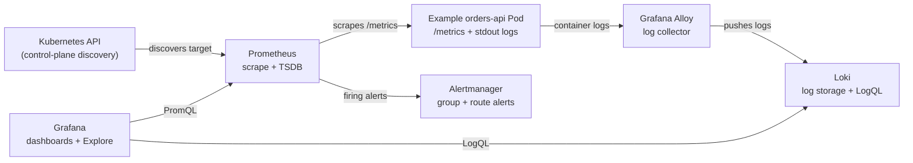

# Prometheus

Prometheus is an open-source monitoring and alerting system for numeric measurements. It discovers targets, periodically reads their metrics over HTTP, stores the samples as time series, and provides PromQL for querying and alert rules. Prometheus is commonly used for application and infrastructure monitoring, including Kubernetes clusters.

## What It Is

A metric is a named measurement, such as the number of HTTP requests, memory in use, or request duration. Prometheus stores each observation with a timestamp. A time series is identified by its metric name and the complete set of labels attached to it.

For example, these are distinct time series:

```text
http_requests_total{app="catalog",method="GET",status="200"}
http_requests_total{app="catalog",method="GET",status="500"}
```

The labels make it possible to filter and aggregate measurements by useful dimensions such as application, namespace, method, and response code. A new label value creates a new time series, so labels should describe a bounded set of values. Avoid labels such as user ID, request ID, or raw URL when they can take on many values; this high cardinality can consume substantial memory and storage.

Prometheus is designed around independent servers that can continue collecting and querying their local data without depending on a distributed database. This keeps the core system straightforward and useful during failures, but an individual Prometheus server's local data is not automatically replicated or made highly available.

## How It Works

Prometheus usually uses a pull model: at a configured interval, it makes an HTTP request to each target's metrics endpoint, commonly `/metrics`, and records the returned samples. A scrape configuration defines the targets and interval; targets can be listed directly or discovered from a platform such as Kubernetes. Pulling lets Prometheus determine whether a target is reachable and records scrape health, including the `up` metric.

Applications can expose metrics through a client library or instrumentation middleware. Exporters provide the same endpoint for systems that do not expose Prometheus metrics themselves; for example, Node Exporter reports host and operating-system metrics, while database exporters report database health and activity. Short-lived batch jobs can use Pushgateway as an intermediary, but it is not intended to turn Prometheus into a general push-based collector.

In Kubernetes, Prometheus can use the Kubernetes API for service discovery and then scrape selected pods or services. The API is used to find targets; Prometheus still reads metrics from the target's HTTP endpoint. Deployments using Prometheus Operator commonly define scrape targets with resources such as `ServiceMonitor` or `PodMonitor`, while a plain Prometheus deployment can use native Kubernetes service-discovery configuration.

Prometheus stores samples under their metric name and labels. PromQL can select, filter, aggregate, and calculate rates over those time series. For example, this query estimates the per-second request rate over the last five minutes, grouped by status code:

```promql
sum by (status) (rate(http_requests_total{app="catalog"}[5m]))
```

Counters generally increase over time and are commonly queried with `rate()` or `increase()`. Gauges represent values that can rise and fall, such as in-flight requests or memory usage. Histograms record observations in buckets and can be used to estimate latency distributions and percentiles. Metric naming and label conventions matter because dashboards and alerts depend on them.

Prometheus also evaluates two kinds of rules. Recording rules periodically calculate and store derived time series, which can make commonly used queries easier or faster. Alerting rules evaluate PromQL expressions and create alert instances when their conditions hold. A `for` duration can require a condition to remain true before the alert fires.

## Storage

Prometheus has a local on-disk time-series database (TSDB). Incoming samples first enter an in-memory head, protected by a write-ahead log (WAL) so the recent data can be recovered after a restart. The TSDB periodically persists data into immutable blocks and compacts older blocks in the background. Queries read from the head and persisted blocks as needed.

The local TSDB is intended for the Prometheus server's local filesystem, not a shared network filesystem. It is not a clustered database: losing the disk or node can lose that server's recent history. In Kubernetes, give Prometheus durable persistent storage and size it for the ingestion rate, retention window, WAL, and temporary compaction space. Treat backups and recovery as operational responsibilities.

If neither a time nor a size retention limit is configured, the default retention time is 15 days. `--storage.tsdb.retention.time` sets a time limit and `--storage.tsdb.retention.size` sets a disk-size limit; if both are set, the first limit reached removes the oldest data. Leave free-space headroom because WAL activity and compaction can temporarily require additional disk. The exact capacity depends on sample rate, label cardinality, and metric shape, so observe real disk use rather than relying only on a generic bytes-per-sample estimate.

For longer retention, centralized querying, or storage across multiple Prometheus servers, deployments can add a remote-storage system. Prometheus supports remote write and remote read integrations; systems such as Thanos or Grafana Mimir add their own architectures and operational requirements. These are additions to the local TSDB, not properties provided automatically by a standalone Prometheus server.

## Alertmanager

Prometheus and Alertmanager have separate responsibilities. Prometheus evaluates alerting rules against metrics and sends resulting alert instances to Alertmanager. Alertmanager handles notification behavior: it groups related alerts, deduplicates repeated notifications, routes groups to configured receivers, and supports silences and inhibition rules.

For example, Prometheus might create an alert when a service's error rate remains above a threshold for ten minutes. Alertmanager can group alerts by cluster and service, route a production page to the on-call receiver, and suppress lower-level symptoms while a broader cluster outage is active. A silence mutes matching notifications for a planned maintenance window; it does not stop Prometheus from evaluating the rule or storing metrics.

This division keeps the alert condition close to the metrics query and the notification policy in a component designed to manage delivery. Alertmanager needs configured routes, receivers, and notification credentials. Prometheus should also be monitored so that a failed scrape, rule evaluation problem, or unavailable Alertmanager does not go unnoticed.

## Grafana

Grafana is a visualization and exploration interface. Configure Prometheus as a data source, and Grafana can issue PromQL queries to build dashboards, inspect time ranges, and compare metrics. Dashboards can be provisioned or exported as JSON so the definitions can be versioned and shared.

Grafana queries Prometheus; it does not collect Prometheus metrics or act as their storage backend. Grafana also has its own alerting system, which can evaluate queries and send notifications. Teams can use Grafana-managed alerts or Prometheus alert rules with Alertmanager, but should choose and document ownership for each alert to avoid duplicate notifications and split-brain routing.

## Loki

Loki is a log aggregation system that is often paired with Prometheus and Grafana. Prometheus stores numeric time series; Loki stores log entries. A log collector such as Grafana Alloy or another Kubernetes log agent reads container logs and pushes them to Loki, which groups entries into streams using labels.

Loki indexes stream labels rather than the full contents of every log line. Labels such as `cluster`, `namespace`, `app`, and `container` help narrow a query; high-cardinality values such as request IDs are better kept in the log body or structured metadata. Loki queries use LogQL. Grafana can use both Prometheus and Loki data sources, making it possible to start from a metric spike and inspect logs from the same app and time range.

Loki is optional for a Prometheus metrics setup. It provides a separate path for logs and does not replace Prometheus scraping, PromQL, or the Prometheus TSDB.

## How Everything Works Together

Consider an `orders-api` workload running in a Kubernetes cluster. The app exposes request counters, error counts, and latency histograms at `/metrics`, and writes structured logs to standard output. The Kubernetes API lets Prometheus discover the app's scrape target, while a log collector on the cluster reads the pod logs and sends them to Loki.

Prometheus scrapes `/metrics` on an interval and stores samples in its TSDB. Its rules can calculate a request rate or fire an alert if the error rate stays high. Alertmanager groups and routes that alert to the right notification receiver. Grafana queries Prometheus for charts and Loki for log lines; an operator can compare the time of an error-rate increase with the app's logs to investigate what changed.

The app is a workload in the Kubernetes cluster, not a Kubernetes control-plane component. In this example, the control plane's API is involved in target discovery; Prometheus scrapes the app pod or service endpoint directly.



## Further Reading

- [Prometheus overview](https://prometheus.io/docs/introduction/overview/)
- [Prometheus storage](https://prometheus.io/docs/prometheus/latest/storage/)
- [Prometheus alerting overview](https://prometheus.io/docs/alerting/latest/overview/)
- [Grafana Loki overview](https://grafana.com/docs/loki/latest/get-started/overview/)
