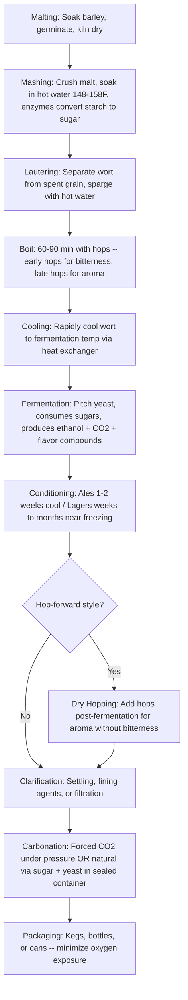

# Beer Overview

## The Two Yeast Families

Nearly all beers fall into two families defined by the yeast species used for fermentation.

Ales use Saccharomyces cerevisiae, which ferments at warmer temperatures (60-75F). At these temperatures the yeast is metabolically active and produces esters (fruity flavors like banana, apple, pear) and phenols (spicy, clove-like flavors) as byproducts. These compounds are a huge part of what gives ales their flavor complexity. Ales are the older family and have the most stylistic diversity.

Lagers use Saccharomyces pastorianus, a hybrid species that can work at much colder temperatures (45-55F). At these temperatures the yeast produces far fewer esters and phenols, resulting in a cleaner flavor profile where you taste the malt and hops more directly. After primary fermentation, lagers go through an extended cold conditioning phase called lagering (from the German "lagern", to store) at near-freezing temperatures for weeks to months. This is why lagers tend to taste crisper and more straightforward than ales.

There is also a smaller third category of spontaneously fermented beers (lambics, gueuze) that rely on wild yeast and bacteria rather than a pitched culture.

## Beer Styles

### Ales

Pale ale is the broad category for hop-forward, moderately strong beers. English pale ales tend to be balanced and earthy, while American pale ales lean on citrusy and piney hops. India Pale Ale (IPA) has become its own massive universe including West Coast IPA (bitter, dry, clear), New England/Hazy IPA (juicy, soft, turbid), Double/Imperial IPA, and many more.

Stouts and porters are the dark beer family. Porter came first historically (1700s London), and stout originally meant "strong porter." Sub-styles include dry stout (Guinness-style), milk/sweet stout (brewed with lactose), oatmeal stout, imperial/Russian imperial stout (high ABV, intense roast), and pastry stouts (brewed with adjuncts like vanilla, chocolate, maple).

Wheat beers use a significant proportion of wheat malt. German hefeweizen has banana and clove flavors from the yeast. Belgian witbier is spiced with coriander and orange peel. American wheat ales tend to be cleaner.

Belgian ales include dubbel (dark, malty, fruity), tripel (golden, strong, spicy), quadrupel (very strong, rich), saison/farmhouse ale (dry, peppery, complex), and Belgian strong golden ale.

Brown ales range from mild English versions (nutty, low ABV) to more assertive American browns. Amber/red ales sit in the middle ground with moderate malt sweetness and caramel character. Barleywine is essentially the strongest traditional ale style, rich and often aged, with ABVs pushing 8-12%+.

### Lagers

Pilsner is the most influential lager style. Czech/Bohemian pilsner is richer and bready with Saaz hops. German pilsner is crisper, drier, and more firmly bitter. Most mass-market beers worldwide (Budweiser, Heineken, Corona) descend from this tradition.

Helles is the Munich answer to pilsner, malt-forward and soft. Marzen/Oktoberfest is the amber, malty lager traditionally brewed in March for autumn festivals. Dunkel is the dark Munich lager, toasty and bready. Vienna lager is amber with a toasty malt character (Negra Modelo is a well-known example).

Bock is stronger lager territory. Traditional bock is malty and robust, doppelbock is even stronger (monks brewed these as "liquid bread" for fasting periods), and eisbock is freeze-concentrated.

Schwarzbier is the black lager, dark in color but light and crisp in body. American lager/light lager is the high-adjunct (corn, rice), low-bitterness style that dominates global commercial production.

### Hybrids

A few styles blur the ale/lager line. Kolsch (Cologne) is an ale fermented warm then cold-conditioned like a lager. Altbier (Dusseldorf) is an amber ale with lager-like crispness. California Common/Steam Beer uses lager yeast at warmer ale temperatures.

## The Brewing Process

### Malting

Before brew day, barley is soaked in cool water, allowed to partially germinate for a few days, then dried in a kiln to stop growth. This develops the diastatic enzymes (alpha-amylase and beta-amylase) needed to convert starch into sugar later. Barley is the preferred grain because it has the highest enzyme content and a thick husk that acts as a natural filter bed during lautering.

### Mashing

The malted barley is crushed and soaked in hot water (148-158F) in a vessel called a mash tun. The heat activates those enzymes, which break down the barley's starches into fermentable sugars (primarily maltose). The temperature of the mash matters: lower temperatures produce more fermentable sugars (drier, thinner beer), higher temperatures produce more unfermentable sugars (sweeter, fuller beer). The sweet liquid extracted from this step is called wort.

### Lautering

The wort is separated from the spent grain. The barley husks form a natural filter bed that lets liquid drain through while holding back the solids. The grain bed is typically rinsed with additional hot water (sparging) to extract remaining sugars.

### The Boil

The wort is brought to a vigorous boil, typically for 60-90 minutes. Hops are added at various points during the boil. Hops added early contribute bitterness (alpha acids isomerize into iso-alpha acids during prolonged boiling). Hops added late contribute flavor and aroma (the volatile essential oils are preserved). The boil also sterilizes the wort, precipitates proteins, and drives off unwanted volatile compounds.

### Cooling

The wort must be cooled rapidly from boiling down to fermentation temperature. This is done with a heat exchanger (a wort chiller). Rapid cooling is important both to reach safe pitching temperature and to form a good "cold break" (protein coagulation that helps clarity).

### Fermentation

Yeast is pitched into the cooled wort. The yeast consumes the sugars and produces ethanol (alcohol), carbon dioxide, and hundreds of flavor-active byproducts (esters, phenols, fusel alcohols). Primary fermentation takes roughly one to two weeks for ales, two to three weeks for lagers. The brewer monitors temperature and gravity readings but mostly just lets the yeast work.

### Conditioning

After primary fermentation, the beer needs time to clean up. The yeast reabsorbs some undesirable compounds (especially diacetyl). Ales may condition for a week or two. Lagers go through extended cold conditioning (lagering) at near-freezing temperatures for weeks to months, which smooths out flavors and clarifies the beer.

### Dry Hopping (Style Dependent)

For hop-forward styles like IPAs, hops are added directly to the beer after fermentation. Since there is no boiling, this extracts maximum aroma and flavor from the hop oils without adding significant bitterness.

### Clarification

The beer is clarified either through time and cold temperatures (natural settling), fining agents (isinglass, gelatin, Irish moss), or mechanical filtration. Some styles are intentionally left hazy.

### Carbonation

The beer is carbonated either by forced carbonation (pumping CO2 into the beer under pressure) or natural carbonation (adding a small dose of sugar before sealing so the remaining yeast produces CO2 in the container).

### Packaging

The finished beer goes into kegs, bottles, or cans. Minimizing oxygen exposure at this stage is critical to prevent staling.

## Why Carbonation

CO2 dissolved in beer provides a physical effervescence that makes the beer feel lighter and more refreshing. Without it, even well-made beer tastes flat and heavy. The tongue has an enzyme (carbonic anhydrase) that converts dissolved CO2 into carbonic acid, giving carbonated drinks a slight acidic bite that helps balance residual malt sweetness.

Carbonation also drives aroma delivery. Rising bubbles carry volatile aroma compounds into the headspace above the beer, which is why pouring into a glass matters and why different glassware shapes exist for different styles.

The level of carbonation changes perceived body. Higher carbonation feels crisper and drier (German pilsners, Belgian tripels). Lower carbonation feels smoother and rounder (British cask ales). Nitro beers replace most CO2 with nitrogen, forming smaller bubbles and a velvety smooth texture without the carbonic bite.

Carbonation is not an invention so much as a natural consequence of fermentation. If you ferment in a sealed container, the CO2 dissolves into the liquid. Deliberate control of carbonation levels became practical with industrial CO2 production and pressurized vessels in the late 1800s.

Not all beer is heavily carbonated. British cask ales are barely carbonated, nitro stouts use nitrogen for a creamy texture, and Belgian ales can be very highly carbonated for an effervescent character.

## Diagram

