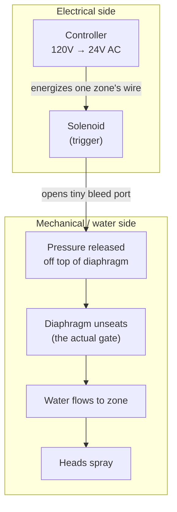

# Home Irrigation System

## Overview

A home irrigation system is smart *scheduling* layered on top of dumb hydraulics. Water moves through fixed pipes and heads; the only intelligence in the system is deciding which zone runs, when, and for how long. Almost all troubleshooting comes down to one distinction: the electrical (trigger) side versus the mechanical (water) side. Keep those two straight and most problems diagnose themselves.

## The Flow, End to End

Cut power and the chain reverses: the solenoid closes, pressure rebuilds on top of the diaphragm, the diaphragm reseats, and flow stops.

## Architecture

A single supply line, usually tapped after the meter, feeds the whole system through a backflow preventer (stops irrigation water from siphoning back into potable supply — required by most municipalities and often needing annual certified testing). From there water reaches a manifold of valves, each controlling one zone (a group of heads). Yards are split into zones mainly because of limited flow (GPM) rather than pressure: the supply only delivers so many gallons per minute, so heads are grouped into zones that fit that budget. Zoning also lets you separate plant types — turf on one zone, drip beds on another.

## Head Types

- Spray heads — fixed fan pattern, high precipitation rate. Good for small/tight areas but lose more to evaporation and overspray.
- Rotor heads — rotating stream, lower precipitation rate, even coverage on large lawns.
- Drip / micro-irrigation — tubing with emitters for beds, planters, and trees. Most efficient, increasingly the default for anything that isn't turf, and often required by water-conscious districts.

## The Controller

The controller is the brain, and the one rule to remember is that no water ever touches it — it lives somewhere dry with power (garage wall, closet, weatherproof exterior enclosure). It runs on 120V, steps that down to 24V AC, and its only job is to energize one zone's wire at a time on a schedule, cycling through zones sequentially because flow limits usually prevent running two at once.

The right mental model is a switch panel, not a water device. It decides which zone's wire gets 24V AC; all real water control happens at the manifold. Because of that clean separation, swapping the controller (dumb timer → Rachio → OpenSprinkler) changes nothing downstream — the valves, wiring, and manifold all speak the same 24V AC language.

## How a Valve Works

Valves are normally-closed: with zero power they default shut. Counterintuitively, a valve holds shut using water pressure itself, not solenoid muscle — pressure sits on top of a rubber diaphragm, pressing it against the seat to seal. The solenoid on top is just the trigger: when it receives 24V AC, it opens a tiny internal port that bleeds pressure off the top of the diaphragm. With that top-side pressure gone, incoming water shoves the diaphragm up and flows to the zone.

So the solenoid is the trigger (electrical side) and the diaphragm is the actual gate (mechanical side) — the single most useful distinction in the whole system.

## Common Failures

- Broken/misaligned heads — most common by far; cracked heads geyser and drop zone pressure.
- Clogged nozzles/emitters — grit causes dry spots. Drip failures are subtle — usually a plant slowly dying.
- Valve won't close (weeping/dripping zone) — the diaphragm isn't sealing. Causes: debris under the diaphragm, a torn or hardened diaphragm, a weak return spring, a clogged bleed port, a manual bleed screw left open, or debris on the solenoid seat.
- Valve won't open (dead zone) — usually electrical: controller, wiring, or solenoid.
- Wiring issues — corroded splices, rodent damage, water intrusion. A healthy solenoid reads ~20–60 ohms across the leads.
- Line leaks — soggy patches, bill spikes, zones that never build pressure.
- Pressure problems — too low and rotors won't turn or heads won't pop; too high and you get misting, fogging, and premature wear. Fix the high side with a pressure regulator or pressure-regulating heads.

## Diagnosing a Zone That Won't Shut Off

First, shut off the irrigation supply to stop the flooding. Then run the one test that splits the problem in half: unplug the controller entirely, turn the water back on, and watch the zone. If it still sprays with no power, the problem is mechanical (diaphragm not sealing). If it stops instantly, it's electrical (controller or wiring stuck energizing the zone). If *multiple* valves fail at once, suspect a common cause — a debris storm through the lines, or chronically high pressure (check with a $10 gauge on a hose bib; over ~70–80 psi is a real factor).

## Mechanical Fix (per valve)

1. Confirm the manual bleed screw and solenoid are fully closed — a bumped-open one mimics a real failure.
1. Open the bonnet slowly (there's a spring underneath); remove the diaphragm and spring.
1. Inspect and clean the diaphragm, spring, and seat. Look for debris holding it open and check the rubber for tears, warping, or hardening.
1. Clear the ports — both the tiny bleed/weep port and the solenoid port. A clogged bleed port keeps pressure from rebuilding on top.
1. Reassemble — correct diaphragm orientation, spring seated, bonnet even, screws snug (don't overtorque and crack the body).
1. If the diaphragm is torn or hardened, use a rebuild kit (~$15); replace the whole valve if the body is cracked.
1. Test: water on with the controller off (should hold shut), then controller on and manually cycle (should open *and* close on command).

To locate a manifold leak: water coming out the heads downstream means the valve is passing water (a diaphragm sealing problem), while water pooling or spraying in the valve box means a plumbing leak — a failed bonnet o-ring, cracked body, or loose fitting. Both can be true at once.

## Exposed Manifold (No Box)

An exposed manifold is common and not a code violation — valves are UV-stabilized and built to get wet — but leaving it unprotected does raise the failure rate. The box guards against everything *except* water: UV degradation (the biggest factor in SoCal sun — it embrittles bodies, solenoid caps, and wire insulation, and shade roughly doubles plastic/wire lifespan), connection corrosion (use gel-filled waterproof connectors), physical damage from mowers, trimmers, feet, and pets, and temperature cycling (freeze-burst isn't an OC concern). Sun exposure is a plausible reason several valves would age out together. Fixes run cheap to involved: drop an above-ground enclosure over it, shade it, redo splices in waterproof connectors, or relocate below grade (a real re-plumb, usually only worth doing during a redo).

## Smart Home Integration

The smart capability lives entirely in the controller; everything downstream is unchanged. The crucial caveat: a smart controller does not change flow rate. Flow is fixed by pressure, pipe sizing, and heads — the only levers are which zones run and for how long. "Watering less" means fewer minutes or a skipped day, at the same pressure.

The behaviors that actually earn their keep are weather/ET scheduling (computes evapotranspiration — water lost to heat, sun, wind, and humidity — and replaces exactly that, the main money-saver), rain/freeze/wind skip, seasonal adjust, and cycle-and-soak (splits long runtimes into bursts with soak gaps to prevent runoff). With an added flow sensor you also get flow monitoring, which detects broken heads (high flow) or clogs (low flow) and can alert or shut off — it *senses* flow, it doesn't control it, and it would have caught the stuck-zone flood automatically.

For Home Assistant, cloud controllers (Rachio, Rain Bird, Hunter Hydrawise) have mature integrations and ET out of the box but keep the cloud in the path (HA → vendor cloud → controller). OpenSprinkler is open hardware with a local HTTP API, so HA talks to it directly with no cloud — you drive zones from your own automations, gate on your own weather or Zigbee/Matter soil-moisture data, log to your own metrics, and expose each zone as an HA entity. It drops onto the existing manifold like any other controller. Either way the architecture is `HA (automations + weather/moisture) ↔ controller (local or cloud) → 24V AC to solenoids → valves → zones`.

Sequence matters: fix the manifold first. A smart controller driving a stuck-open valve just floods the yard intelligently. The brain swap is decoupled and easy — do it once the hydraulics are healthy.

## When to Water

Target pre-dawn to sunrise, roughly 4–9 AM — one rule: water before dawn. Morning wins on every axis: evaporation is minimal (cool, calm, little sun, so water soaks in), foliage dries during the day (avoiding the prolonged leaf wetness that breeds fungal disease), pressure is steadier before peak neighborhood demand, and a full soil profile going into daylight matches when plant uptake peaks. Midday is the worst option — peak heat, sun, and wind mean maximum evaporation (the "droplets scorch the grass" idea is mostly a myth; the real loss is plain evaporation). Evening and night cut evaporation but leave foliage wet all night, so they're only an acceptable fallback when morning is impossible.

With smart scheduling, anchor runtimes to finish around sunrise (which tracks the season automatically), apply cycle-and-soak within that window, scale total minutes by ET, and skip on rain. Note that OC water districts often impose watering-day and time-of-day restrictions during drought — an early-morning habit usually lines up with compliance, but district rules change year to year, so check the current ones.

## Action Sequence (Current Situation)

1. Irrigation supply already shut off — good.
1. Run the unplug-the-controller test to confirm mechanical vs. electrical.
1. Rebuild and clean both leaking valves (buy two rebuild kits).
1. Redo wire splices in gel-filled waterproof connectors while everything's apart.
1. Inspect the remaining valves for UV chalking and cracks.
1. Check static pressure; add a regulator if it's over ~70–80 psi.
1. Set an above-ground enclosure over the exposed manifold.
1. Only then, if you want it: swap to OpenSprinkler + Home Assistant.
