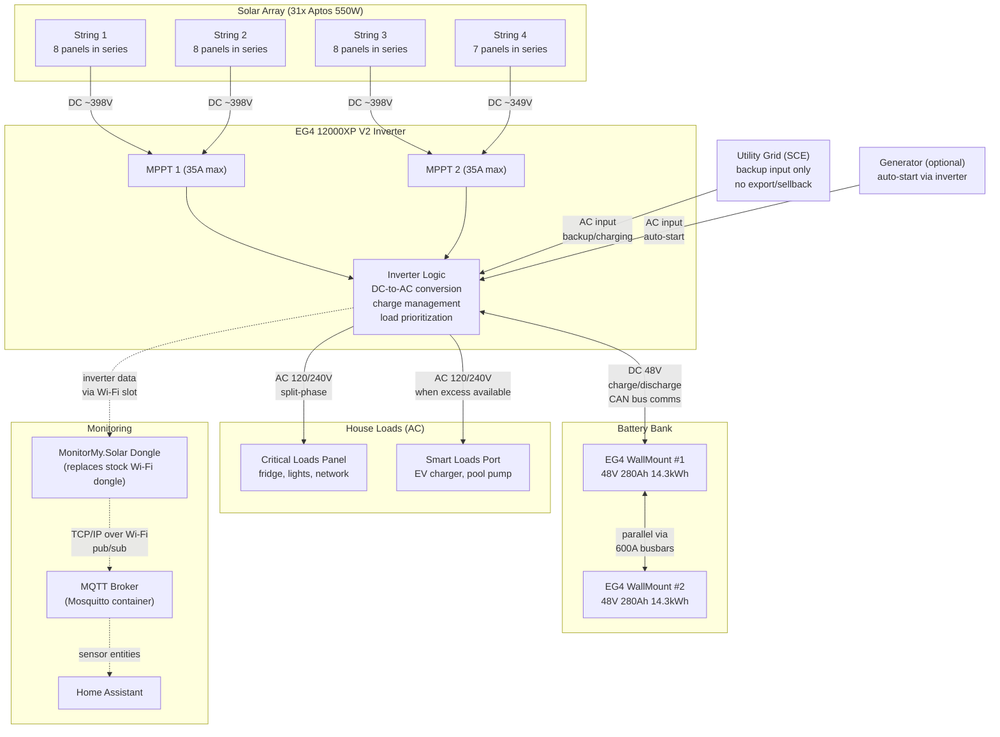

# Solar

## Why Go Solar

Solar lets you generate your own electricity, store it, and use it on your own terms. A properly sized system with battery storage can eliminate or drastically reduce a $200-400/month electric bill, paying for itself in 8-12 years with 30+ years of panel life remaining.

The core value proposition in 2026 is self-consumption: power your house from solar during the day, charge batteries with the excess, and discharge them in the evening when utility rates are highest. Battery storage also provides backup power during grid outages, which is particularly relevant in SoCal given fire season and PSPS shutoffs.

Selling excess power back to the grid is no longer a major factor. California's NEM 3.0 (effective April 2023) dropped export credits by roughly 75%, from ~$0.30/kWh to $0.05-0.08/kWh. The federal 30% Residential Clean Energy Credit also expired for homeowner-owned systems after December 31, 2025. State-level incentives like California's SGIP for battery storage may still apply.

## How Solar Works

### Photovoltaic (PV) Basics

PV stands for photovoltaic, meaning "converts light into electricity." Solar panels contain silicon cells that generate direct current (DC) electricity when photons from sunlight knock electrons loose. Each panel produces a relatively low voltage (around 40-50V), so panels are wired together in series to add up voltage into a usable range.

### DC vs AC

Solar panels and batteries operate in DC (direct current), where electricity flows in one direction at a constant voltage. Your house runs on AC (alternating current), where the current reverses direction 60 times per second at 120V or 240V split-phase. The inverter handles the conversion between these two worlds. It takes DC from the panels, converts it to AC for your house loads, and also manages DC charging/discharging of the batteries.

### Strings and MPPTs

Panels are wired into "strings" of several panels connected in series (positive to negative), which adds their voltages together. Multiple strings can be wired in parallel to increase current. An MPPT (Maximum Power Point Tracker) is a charge controller built into the inverter that continuously adjusts its input impedance to extract the maximum possible power from the panels as conditions change (cloud cover, temperature, time of day).

## Bifacial

Bifacial panels have solar cells on both sides. The rear side can capture reflected light from the ground, increasing total energy production by up to 25% in ideal conditions (light-colored roof, reflective ground surface). They tend to be more expensive but can be worth it for the extra yield, especially in areas with high electricity rates.

- Typically not worth it on a roof, but can be a good choice for ground-mounted systems.

This means if a panel is rated at 550W, it might produce up to 25% more energy from the rear side under optimal conditions, for a total of 650-700W.

## System Diagram

## Components

### Inverter: EG4 12000XP Off-Grid Inverter V2

The central brain of the system. All power flows through it.

- 12kW continuous AC output (15kW with PV + battery present), split-phase 120/240V
- Dual MPPTs, each with two inputs (four PV inputs total)
- Accepts up to 24kW of solar input at up to 480VDC max
- Each MPPT handles up to 35A
- 100A grid bypass with 10ms transfer time during outages
- Dedicated generator port with auto-start capability
- Smart load port for non-critical loads (EV charger, pool pump, etc.)
- Built-in arc fault protection and rapid shutdown (RSD) capability
- Wi-Fi monitoring via EG4 app
- Does NOT support grid export/sellback
- 5-year warranty (extendable with EG4 batteries)

### Battery: EG4 WallMount Indoor 48V 280Ah (14.3kWh)

Wall-mounted LiFePO4 battery for indoor energy storage.

- 51.2V nominal, 280Ah capacity, 14.3kWh total storage
- ~11.4kWh usable at 80% depth of discharge
- 200A continuous charge/discharge, 300A+ surge for 3 seconds
- Integrated 200A BMS with real-time cell monitoring
- Built-in 600A busbars (4 positive, 4 negative terminals) for easy parallel wiring
- Self-heating for cold environments (activates below 32F)
- Dual fire arrestors, emergency stop function
- LCD touchscreen for monitoring
- RS485 and CAN bus communication for closed-loop inverter integration
- 8,000+ cycles at 80% DoD (~22 years at one cycle per day)
- 10-year warranty
- Weight: 282 lbs
- EG4 recommends 400Ah+ per inverter, so minimum 2 batteries ($6,500-7,500 for a bundle)

A "cycle" means draining from full to minimum recommended discharge and back. Partial cycles count proportionally (two days at 50% discharge equals roughly one full cycle).

### Panels: Aptos DNA-144-BF10-550W-DG (x31 pallet)

Bifacial monocrystalline panels with dual glass construction.

- 550W STC rated per panel, 17.05kW total for 31-panel pallet
- Voc: 49.80V, Vmp: 41.95V, Isc: 13.99A, Imp: 13.11A
- 21.29% module efficiency
- Bifacial design: up to 25% rear-side gain (up to 688W per panel) in reflective environments
- Dual glass, 5400 Pa snow load, 4000 Pa wind load
- All-black aesthetic
- 30-year product and power performance warranty
- Dimensions: ~90" x 45", ~45 lbs each

### Additional Materials Needed

- Racking/mounting hardware (IronRidge, Unirac, etc.) for roof or ground mount
- PV wire (10 AWG USE-2) and conduit
- MC4 connectors and branch connectors
- Battery cables (2/0 AWG or larger, Degson connectors included with battery)
- Rapid shutdown disconnect switch (required for NEC 690.12)
- Subpanel or transfer switch for AC side
- Breakers and grounding hardware
- Optional: generator for backup charging

### Total Cost Estimate

| Component | Cost |
| ------------------------------------- | ------------------ |
| Inverter (EG4 12000XP V2) | $1,900-2,600 |
| Batteries (2x WallMount Indoor 280Ah) | $6,500-7,500 |
| Panels (31x Aptos 550W pallet) | $5,500-7,500 |
| Racking, wiring, hardware | $2,000-4,000 |
| Professional install (optional) | $3,000-8,000 |
| **Total (DIY)** | **$16,000-21,000** |
| **Total (with professional install)** | **$19,000-29,000** |

## String Design

The inverter's MPPT voltage window and current limits determine how panels are wired.

Max voltage per MPPT: 480VDC. Each Aptos panel has a Voc of 49.80V.

Max panels per string: 480V / 49.80V = 9.6, so maximum 9 panels per string. Cold temperatures push Voc higher (voltage temperature coefficient is negative), so 8-9 panels per string is the safe range for SoCal.

Max current per MPPT: 35A. Each panel string produces 13.99A Isc. Two strings in parallel per MPPT: 2 x 13.99A = 27.98A, safely under 35A.

Layout for 31 panels across 2 MPPTs (4 inputs total):

- MPPT 1: two strings of 8 panels (16 panels)
- MPPT 2: one string of 8 + one string of 7 (15 panels)

Total PV: 31 x 550W = 17,050W, well within the inverter's 24kW capacity.

## How the System Works Day-to-Day

Once configured, the system runs autonomously. The inverter manages everything based on priority settings you configure once through the EG4 app.

During the day, solar panels generate DC power. The inverter converts it to AC to power house loads in real time. Any excess charges the batteries. If both loads are satisfied and batteries are full, excess solar is curtailed (wasted, since this inverter doesn't export to grid).

In the evening, when solar production drops, the inverter seamlessly switches to discharging the batteries to power loads. This avoids buying expensive peak-rate grid power from SCE during 4-9 PM.

If batteries deplete overnight, the inverter can pull from the grid (if connected) or start a generator automatically based on a configurable SOC threshold.

During a grid outage, the inverter transfers to battery power within 10ms, fast enough that most electronics don't notice. Solar continues charging batteries during the outage.

The smart load port only powers its circuits when excess power is available above a configurable battery SOC threshold, useful for non-critical loads you only want running when you have surplus energy.

No manual intervention is needed day-to-day. The only regular maintenance is hosing down panels a couple times a year to clear dust/pollen, and occasionally checking the monitoring app for error codes or cell imbalance.

## Component Lifespan

| Component | Expected Life | Warranty | Notes |
| ----------------- | ------------- | ----------------------- | -------------------------------------------------- |
| Solar panels | 30-40 years | 30-year product + power | ~80-85% output at year 25-30 |
| Battery (LiFePO4) | 15-22 years | 10-year | 8,000 cycles at 80% DoD |
| Inverter | 10-15 years | 5-year | Fans, capacitors, power electronics are wear items |

General lifecycle: panels outlive everything. Expect to replace batteries once and the inverter once or twice over the panel lifespan.

## Volts, Amps, and Watts

The relationship is always: watts = volts x amps. Watts measure instantaneous power. Volts measure electrical pressure. Amps measure the flow of current. Watt-hours (Wh) measure energy over time, and are what show up on your utility bill.

### Example: Powering a Toaster on a Sunny Day

Imagine one minute of perfect sunlight followed by immediate blackness, with a single toaster as the only load in the house.

All 31 panels produce 17,050W at that instant. A toaster is rated at 1,200W. On a standard 120V household circuit, that means it draws 10 amps (1,200W / 120V = 10A). This is why kitchen outlets sit on 15A or 20A breakers -- enough headroom for the toaster plus some margin.

The inverter converts just enough DC to AC to feed the toaster (1,200W). The remaining 15,850W goes to charging the batteries. If the batteries are already full, the excess is curtailed (wasted).

Since that minute is 1/60th of an hour, the total energy generated is 17,050W x (1/60)h = 284Wh, or about 0.284kWh. The toaster consumed 1,200W x (1/60)h = 20Wh. The other 264Wh went into the batteries. At SCE's peak rate of $0.35/kWh, that one minute of sun produced roughly $0.10 worth of electricity.

The inverter monitors everything in real time because all power flows through it. It knows how much the house is drawing on the AC side, how much DC is coming in from the panels, and the battery state of charge via CAN bus communication with the BMS.

The priority chain is: use solar to feed house loads first, send excess to charge batteries, and pull from grid or generator as a last resort. This all happens continuously and automatically. If you turn on the AC and panels can't keep up, the inverter pulls the difference from batteries instantly. If batteries are low, it falls back to grid or generator.

## Home Assistant Integration

There are three ways to get EG4 inverter/battery data into Home Assistant.

### Option 1: MonitorMy.Solar Dongle (recommended for local-only)

A third-party Wi-Fi dongle (~$50-70) that replaces the stock EG4 Wi-Fi dongle in the inverter's dongle slot. It publishes inverter data over MQTT to a local broker.

Setup:

1. Remove the stock EG4 Wi-Fi dongle from the inverter
1. Plug in the MonitorMy.Solar dongle
1. It broadcasts a temporary Wi-Fi access point
1. Connect to the AP from your phone, configure home Wi-Fi credentials and MQTT broker details (IP, port, username, password)
1. Dongle reboots, joins your network, starts publishing to the broker
1. Deploy Mosquitto (MQTT broker) as a container
1. Install the MonitorMy.Solar HA integration via HACS
1. HA subscribes to the broker and exposes 100+ sensor entities

This is the same captive-portal setup pattern used by most IoT devices (ESP32, Tasmota, smart plugs). Configure once, forget about it.

Tradeoffs: read-only monitoring works well. Writing settings back to the inverter through HA can be unreliable (switches toggling). The project is actively developed but still has some beta-quality rough edges.

### Option 2: Cloud API

No hardware changes needed. Uses the EG4 web monitoring portal API.

1. Install the EG4 Web Monitor integration via HACS (github.com/joyfulhouse/eg4_web_monitor)
1. Enter your monitor.eg4electronics.com credentials
1. HA polls the cloud API and creates sensor entities

Tradeoffs: simplest setup, no extra hardware. But depends on EG4's cloud being up, and data has ~5 minute lag. Also supports control features like charge modes and battery limits.

### Option 3: RS485 Modbus (fastest, fully local)

Physical serial connection from the inverter's CT1 RJ45 port to HA.

1. Connect a USB-to-RS485 adapter or Waveshare RS485-to-Ethernet converter to the inverter's CT1 port
1. RS485A goes to pin 8, RS485B goes to pin 7 on the RJ45 (pinout is non-standard, verify before wiring)
1. If using USB adapter, pass through to the HA container/pod
1. If using Waveshare converter, it bridges serial data to TCP on your LAN
1. Configure the HA integration to connect via Modbus

Tradeoffs: fastest polling (~5 seconds), fully local, no cloud dependency. But requires physical cabling, correct pinout (people have bricked pre-made cables), and USB passthrough or network bridge hardware.

### MQTT Explained

MQTT is a lightweight publish/subscribe messaging protocol over TCP (port 1883). The broker (Mosquitto) is a small container that runs 24/7 as a message bus. Devices publish to "topics" (like `solar/inverter/battery_soc`) and any subscribed client receives messages in near-realtime. It's not radio, it's all standard TCP/IP on the local network.

For a K3s cluster, Mosquitto is a one-liner Helm chart. If other smart home devices speak MQTT (Zigbee2MQTT, Tasmota devices, ESPHome nodes), they all share the same broker.
