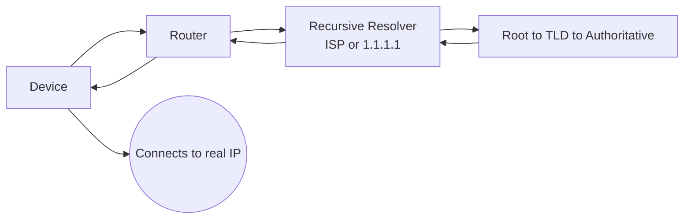
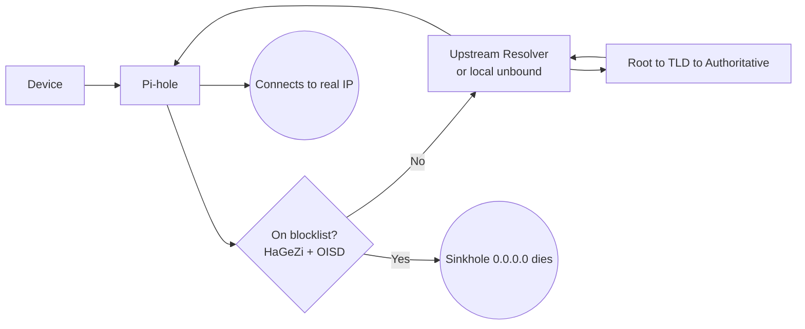

# DNS

## What DNS is

DNS (Domain Name System) translates human-friendly names like example.com into the IP addresses machines actually route to, such as 93.184.216.34. It is a hierarchical, distributed, heavily-cached database. The hierarchy reads right-to-left from an implicit root: the root (.) knows who runs each top-level domain, the TLD servers (.com, .org, .io) know who is authoritative for each domain under them, and the authoritative servers hold the actual records (A/AAAA for addresses, plus MX, TXT, CNAME, and others).

## Why DNS is used

Nobody wants to memorize IP addresses, and addresses change over time while names stay stable. DNS gives us stable, memorable names that map to whatever address a service currently uses. Caching at every layer, governed by TTLs, keeps the system fast and prevents it from collapsing under global load.

## The players involved

Stub resolver: lives on your device as part of the OS. It does no real work; it just asks someone smarter and caches the answer.

Router: on a home network this is usually a forwarder. It receives queries and relays them to something else, and it hands out network settings to devices via DHCP.

When a device joins a network, it doesn't magically know how to participate — it needs a handful of settings. DHCP is the protocol that hands those settings to the device automatically instead of you configuring each one by hand. The core things it typically assigns:

- An IP address for the device (this is the part you're thinking of with reservations)
- The subnet mask (which addresses are "local")
- The default gateway (your router — how to reach anything off-LAN)
- The DNS server(s) ← this is why it keeps surfacing in our DNS talk

ISP resolver (or a public recursive resolver): the recursive resolver is the workhorse that walks the hierarchy on your behalf and caches aggressively. By default this is your ISP's resolver, but it can be a public one like 1.1.1.1 (Cloudflare), 8.8.8.8 (Google), or 9.9.9.9 (Quad9).

Authoritative servers: the servers that actually hold the records for a domain and give the definitive answer.

## Three distinct roles (the part that confuses people)

Forwarding and recursing are different jobs, and a box can do one, the other, or both.

Stub resolver: asks someone smarter, caches. Never changes.

Forwarder: a middleman that relays queries elsewhere, optionally caching or filtering. It does not walk the hierarchy itself.

Recursive resolver: the only role that resolves a name from scratch by walking root to TLD to authoritative.

## How a normal lookup works

1. The app calls the OS; the stub resolver checks its cache (miss).
1. It sends the query to the DNS server handed out by DHCP, usually the router, which forwards to the ISP resolver.
1. The recursive resolver checks its cache (miss) and walks: root tells it the .com nameservers, the .com TLD tells it the authoritative nameservers, the authoritative server returns the IP.
1. The resolver caches the answer (honoring TTL) and returns it down the chain.
1. Your device connects to that IP.

In this path every domain resolves truthfully, including ad and tracker domains.

## What Pi-hole is

Pi-hole inserts itself as the DNS server for your whole LAN and adds a filtering gate in front of resolution. You point your router's DHCP to hand out Pi-hole's IP as the DNS server, so every device asks Pi-hole with no per-device setup. Pi-hole itself is configured with an upstream resolver that it forwards non-blocked queries to.

Important: by default Pi-hole is a forwarder with a filter, not a recursive resolver. It is essentially the same role your router already played, with a blocklist bolted on. The recursion still happens upstream unless you change it.

## HaGeZi + OISD blocklists

OISD and HaGeZi are curated, actively-maintained lists of domains known to serve ads, tracking, telemetry, malware, and phishing. You add them to Pi-hole as adlist URLs.

OISD: a large aggregated list tuned to minimize false positives, commonly used as Small vs Big.

HaGeZi: tiered as Light, Normal, and Pro (plus specialized feeds like Threat Intelligence), from conservative to aggressive.

When you save these, Pi-hole runs gravity (pihole -g): it downloads each list, deduplicates the domains, and compiles them into its local gravity database. It re-pulls on a schedule to stay current.

## How a Pi-hole lookup works

1. Device stub resolver sends the query to Pi-hole (because DHCP said so).
1. Pi-hole checks the domain against the gravity database first.
1. Not on any list: Pi-hole checks its cache, forwards upstream on a miss, caches, and returns the answer. It behaves like a normal resolver.
1. On a list: Pi-hole sinkholes it and does not forward at all. In default NULL-blocking mode it answers with 0.0.0.0 or ::, an unroutable address, so the connection fails fast. (NXDOMAIN is an alternative mode.)

Pi-hole operates purely at the DNS layer. It never inspects packet content or blocks by IP; its only lever is a per-domain decision to answer truthfully or answer with a dead address.

## Doing DNS yourself (Pi-hole + unbound)

By default Pi-hole forwards non-blocked queries to a third party like Cloudflare, so that company still does the recursion and sees your query stream. Pairing Pi-hole with a local unbound instance changes this. Instead of forwarding to Cloudflare, Pi-hole hands non-blocked queries to unbound, and unbound does the full recursive walk itself, talking directly to root, TLD, then authoritative servers from your own box.

This is the only setup where the recursion genuinely relocates into your network. No single upstream company holds your aggregated lookup history. The trade-off: you lose the warm, nearby anycast cache of a public resolver, so cold lookups are slower (repeat lookups are cached locally either way).

## Diagram: normal setup

## Diagram: Pi-hole setup

## Reasons to use a different resolver

Privacy: your recursive resolver sees every domain you look up. Moving to a no-logging resolver changes who holds that record; running your own unbound means no single upstream company holds it at all.

Performance: better caching and closer points of presence can shave latency, though ISP resolvers are often already fine.

Reliability: ISP resolvers sometimes go down; anycast public resolvers are engineered for very high uptime.

Security filtering: some resolvers block malicious domains by default (Quad9) or offer filtered variants (Cloudflare for families). This overlaps with what HaGeZi and OISD already give you locally.

Avoiding manipulation: some ISPs hijack NXDOMAIN responses or enforce blocking at the resolver; a neutral resolver sidesteps that.

Control: with your own unbound you trust nobody's answers or logging policy and own the whole path.

An honest caveat: even with your own unbound, authoritative servers still see the individual queries that reach them, and your ISP can still observe the connections you open. Running unbound stops one company from holding your aggregated history; it does not make you invisible.

## The two independent choices

All of this comes down to two separate knobs that are easy to conflate.

Do I filter? Run Pi-hole with blocklists like HaGeZi and OISD, or not. This is entirely what Pi-hole is about.

Who does my recursion? ISP, a public resolver like Cloudflare or Quad9, or your own local unbound.

Pi-hole dictates only the first knob. It does not force the second; it just becomes the place where you set the upstream for your whole network. You can mix and match freely: ISP DNS with filtering, Cloudflare without filtering, or your own unbound with filtering.
