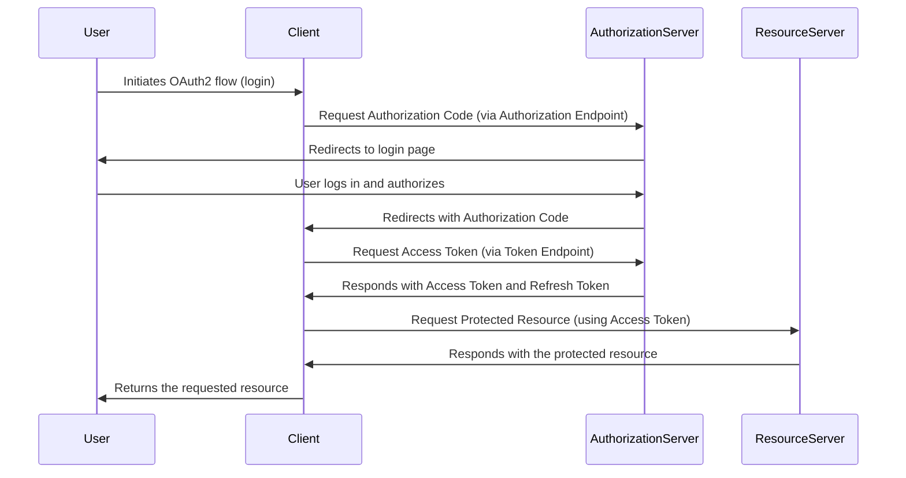

# OAuth 2.0

The OAuth 2.0 flow is a widely used protocol for authorization and authentication on the web. It allows users to grant third-party applications limited access to their resources (such as profile information or data) without sharing their credentials (like passwords). OAuth 2.0 defines several different grant types, each suitable for different scenarios and use cases. Here's a high-level overview of the OAuth 2.0 flow:

1. **Client Registration**: Before initiating the OAuth 2.0 flow, the client application (the application requesting access to the user's resources) must register with the authorization server (the server responsible for authenticating the user and issuing access tokens).

1. **Authorization Request**: The OAuth 2.0 flow begins when the client application redirects the user to the authorization server's authorization endpoint. The client includes specific parameters in the request, such as the client ID, redirect URI, scope, and optionally a state parameter. The scope specifies the requested permissions, and the state parameter is used to prevent CSRF attacks by binding the request to a specific user session.

1. **User Authentication**: Upon receiving the authorization request, the authorization server prompts the user to authenticate and authorize the client application's access to their resources. The user may need to log in and consent to the requested permissions.

1. **Authorization Grant**: After the user grants permission, the authorization server issues an authorization grant to the client application. The type of grant depends on the OAuth 2.0 flow being used. Common grant types include authorization code, implicit, resource owner password credentials, and client credentials.

1. **Token Request**: The client application exchanges the authorization grant for an access token by sending a token request to the authorization server's token endpoint. The request typically includes the authorization grant, client ID, client secret (for confidential clients), and redirect URI.

1. **Access Token Response**: If the token request is valid, the authorization server responds with an access token and, optionally, a refresh token. The access token is a credential that the client application can use to access the user's resources on behalf of the user.

1. **Accessing Protected Resources**: The client application includes the access token in API requests to the resource server (the server hosting the user's resources). The resource server verifies the access token and grants access to the requested resources if the token is valid and authorized.

1. **Token Refresh (Optional)**: If the access token expires or becomes invalid, the client application can use the refresh token (if provided) to obtain a new access token without requiring the user to re-authenticate. This process is known as token refresh.

1. **Revoking Tokens (Optional)**: The user or client application can revoke access tokens or refresh tokens if they are no longer needed or compromised. This helps maintain the security and integrity of the OAuth 2.0 flow.

1. **End of Session**: The OAuth 2.0 flow ends when the user logs out or the access token expires. At this point, the client application must obtain a new access token to continue accessing the user's resources.

Overall, the OAuth 2.0 flow allows for secure and controlled access to user resources by third-party applications without exposing the user's credentials. It provides a standardized framework for authorization and authentication on the web, making it widely adopted for various use cases, including social login, API access control, and delegated authorization.

## Diagram

## OAuth2 eli5

1. A user wants to log in to a new service using their Gmail account.
1. The user clicks the "Log in with Gmail" button.
1. The client (service) redirects the user to Google's authorization server, where the user is asked to log in and grant permission for the service to access their Gmail data.
   - This step allows the service to validate the user’s identity but never directly receives the user’s credentials.
1. Once the user grants permission, Google's authorization server sends an authorization code back to the client (usually through a redirect URL).
   - This is a temporary token that expires quickly and can only be used once
   - It's sent to the service, not the user's browser, making it less exposed to security risks.
1. The client then exchanges the authorization code for an access token by sending it to Google's `/token` endpoint.
   - The authorization code flow ensures that the access token is never exposed to the client directly, except when used to request data from Google's API.
1. The client can now use the access token to request Gmail data from Google’s API.
1. The requested Gmail information is returned to the client and then it sends the necessary data back to the user's browser.
