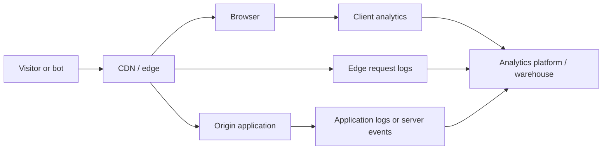

# Bot Traffic in Web Analytics

Bots are part of normal web traffic. Search crawlers, link-preview generators, uptime monitors, AI crawlers, scrapers, vulnerability scanners, and browser automation can all request pages without representing a human reading them. Some identify themselves honestly; others look almost identical to ordinary browsers.

This makes bot traffic a measurement problem as much as a security problem. Security systems ask whether a request should be allowed. Analytics systems ask whether an interaction should count in a business metric. Those decisions use overlapping evidence, but they do not always have the same answer.

The goal for dealing with this is therefore not to find one perfect bot filter. It is to build a measurement process that combines several imperfect signals, explains every exclusion, and produces a stable reported metric without destroying the underlying evidence.

## Why bot traffic distorts analytics

An HTTP request is not the same thing as a page view, and a page view is not the same thing as a person.

- A crawler can request thousands of article URLs without rendering them.
- A headless browser can render a page and execute the same JavaScript as a human visitor.
- A link-preview service may request a page once for every URL shared in a chat.
- A human reader may never appear in client-side analytics because consent was denied, an ad blocker stopped the tag, or the event failed in transit.
- One person can generate many page views across sessions and devices.

Page views, sessions, unique devices, authenticated users, and people must remain separate metrics with separate definitions. If the business reports page views, that number should come from one governed model rather than whichever source or dashboard is convenient.

Bot filtering also requires a policy choice. A search crawler, an AI training crawler, an uptime monitor, and a credential-stuffing script are all automated, but a business may want to observe or handle each category differently. Classification should describe the traffic; reporting policy should decide whether it counts.

## How activity is typically tracked

Most sites observe traffic at more than one layer:

Each source sees a different part of the interaction.

| Source | What it observes | What it misses | Typical bias |
| --------------------- | -------------------------------------------------------------------------------------------- | --------------------------------------------------------------------------------- | ----------------------------------------------------------------------------------------------------------------- |
| CDN or edge logs | Every request that reaches the edge, including blocked and cached traffic | Browser engagement after the response | High relative to human page views because assets, crawlers, previews, prefetches, and retries all create requests |
| Origin logs | Requests and actions that reach the application | Requests served entirely from cache or blocked at the edge; client engagement | Depends on caching and edge policy |
| Client analytics | Events emitted after browser code executes, including route changes, scrolls, and engagement | Visitors blocked by consent, extensions, JavaScript failures, or network failures | Low relative to total human activity, but can be inflated by headless browsers and duplicate instrumentation |
| Server-side analytics | Events emitted by trusted application code | Purely client-side behavior unless forwarded explicitly | Consistent for server-confirmed actions, but can count automated calls unless classified |

The difference between these sources is expected. Edge data answers, “What requested the site?” Client analytics answers, “What did the browser report doing?” Neither is ground truth, and the gap between them is itself a useful signal.

### Model the interaction, not the vendor

Instrumentation, collection, and storage should be separate concerns:

- **Instrumentation** decides that an interaction occurred and constructs its properties.
- **Collection** transports the event from the browser or backend to a receiver.
- **Destinations** store or consume the event, such as GA4, Snowflake, an experimentation platform, or a streaming system.

A site-owned interface such as `analytics.track("article_view", {...})` can hide destinations behind one stable event contract. This keeps the logical event independent of a specific analytics vendor and makes later migrations much cheaper.

For content analytics, use a stable `article_id` rather than a URL or headline as the primary content identifier. URLs move and headlines change. Every event should also include a client-generated `event_id`, because analytics events rarely have a reliable natural key for warehouse deduplication.

Useful event properties include:

- `article_id`, section, author, and content type
- event and ingestion timestamps
- session or anonymous-client identifier
- authenticated user identifier, when appropriate and consented
- referrer and campaign attribution
- device, geography, and consent state
- experiment variant and subscriber status
- an edge request identifier, if row-level reconciliation is required

## Rule out measurement defects first

Unusual traffic is not automatically bot traffic. Before developing new bot rules, verify that the site is not manufacturing extra events.

Common sources of overcounting include:

- A single-page application firing both an automatic and a manual page-view event on a route change.
- The same tag being deployed in application code and a tag manager.
- Speculative loading or prerendering executing custom tags before the page becomes visible.
- Back/forward-cache restores, tab restores, or reload loops producing new events.
- Syndicated pages, webviews, or alternate surfaces counting the same reading session more than once.
- Auto-refreshing live coverage or infinite scroll without an explicit counting rule.
- Retries creating duplicates because events do not have stable IDs.

Test normal navigation, reloads, history changes, restored tabs, prerender activation, and consent transitions in the browser. Inspect the outbound collection requests and confirm exactly one event is emitted for each interaction the metric intends to count. Only after the event contract behaves correctly should unexplained patterns be treated as possible automation.

## Identify automated behavior with layered evidence

No single user-agent rule, IP list, browser challenge, or vendor score is sufficient. Robust classification combines evidence that fails in different ways.

### Start with the smell test

Bot investigation often begins before there is a formal classifier. An analyst sees a number that does not make sense given how the product works: one session records 100 ad clicks in a second, a browser reads 500 articles in five minutes, or a campaign receives a large traffic spike without any corresponding increase in engaged sessions. These are useful leads because they violate physical, product, or business expectations.

Run the smell test at several levels:

- **Physical possibility:** Could a person actually perform the actions in the recorded time? Account for concurrent browser tabs and batched event timestamps, but flag behavior that remains impossible after doing so.
- **Product sequence:** Could the events occur in that order? A click should follow an impression, a form submission should follow a rendered form, and a checkout should normally have preceding product or cart activity.
- **Internal consistency:** Do related measures agree? A large increase in ad clicks with flat impressions, page views, sessions, and revenue is suspicious even when the click count alone is technically possible.
- **Historical baseline:** Is the value far outside the normal range for that page, campaign, country, device, or time of day? Compare like with like so a legitimate breaking-news spike is not measured against an ordinary day.
- **Cross-source consistency:** Does the activity appear in edge logs, client analytics, application logs, and downstream business systems where expected? Missing corroboration can reveal either automation or a broken tracking path.

Start with simple distributions rather than individual rows. Plot events per identity per minute, time between actions, pages per session, click-through rate, engagement rate, and the ratio between related funnel events. Examine the extreme tail and sudden changes in those distributions. The goal is to find behavior that deserves explanation, not to declare every outlier a bot.

### Patterns worth flagging

The exact thresholds should be learned from the site's normal traffic, but the following patterns are strong candidates for flags:

| Pattern | Example | Why it is suspicious | What to check before calling it a bot |
| -------------------------------------------- | ----------------------------------------------------------------------------------------------------------------------------- | --------------------------------------------------------------------------------------------------- | ----------------------------------------------------------------------------------------------------- |
| Impossible action rate | One session records 100 ad clicks in one second or 300 article views in one minute | The rate exceeds realistic human input and reading speed | Duplicate tags, event retries, timestamp truncation, or one identifier shared by many users |
| Actions faster than the interface allows | A click arrives a few milliseconds after the impression for thousands of sessions | A person could not perceive and act on the element that quickly | Whether events were batched, replayed, or assigned server timestamps on arrival |
| Missing prerequisite events | Ad clicks appear without impressions, purchases without product or checkout activity, or form submissions without a form view | The observed sequence bypasses the intended user journey | Consent rules, ad blockers, separate devices, server-side events, or missing instrumentation |
| Mechanical timing | Requests arrive every five seconds for hours with almost no variation | Human timing is irregular; automation often follows a fixed schedule | Uptime monitors, feed readers, scheduled integrations, or other approved automation |
| Exhaustive or sequential navigation | One identity requests every article ID in order or traverses the entire sitemap rapidly | The access pattern resembles crawling rather than discovery and reading | Search crawlers, archival jobs, QA tools, and internal link checkers |
| Repeated identical journeys | Thousands of sessions follow the exact same pages, event order, timing, screen size, and parameters | Real user journeys normally contain more variation | Synthetic monitoring, end-to-end tests, demos, kiosks, or a duplicated event payload |
| No browser resource footprint | A client claiming to be a normal browser requests HTML pages but never loads JavaScript, CSS, images, or fonts | Full browsers usually request supporting resources | Text-only browsers, accessibility tools, aggressive caching, blocked resources, or API consumers |
| No engagement at large scale | A source produces many page views but virtually no visibility time, scrolling, navigation, or conversions | The traffic renders little evidence of human attention | Tracking consent, script failures, slow pages, accidental landing traffic, or short legitimate visits |
| Implausible conversion or click-through rate | A campaign suddenly reaches nearly 100% ad click-through or conversion with no matching revenue or fulfillment | Related business measures do not support the reported success | Campaign configuration, attribution changes, test transactions, or delayed downstream data |
| Unnatural time distribution | High-volume activity remains nearly flat every hour of every day or begins and stops at exact boundaries | Human traffic usually follows daily and weekly rhythms | Global audiences, scheduled publishing, batch jobs, and monitoring services |
| Identity churn with stable fingerprints | Client IDs or IPs rotate constantly while user agent, screen, request sequence, and timing remain identical | Automation may rotate one identifier to evade rate limits while preserving the rest of its behavior | Carrier-grade NAT, privacy relays, corporate proxies, or legitimate automated agents |
| Impossible identity movement | The same authenticated account appears in distant countries within seconds while taking rapid actions | The travel and action sequence cannot belong to one person | VPNs, proxy routing, clock errors, shared accounts, or compromised credentials |
| Suspicious network concentration | A consumer campaign suddenly receives most traffic from a small set of data-center ASNs | Hosting networks are common sources of automation | Corporate egress, schools, public Wi-Fi, legitimate crawlers, and the campaign's intended audience |
| Edge and client mismatch | Edge HTML requests surge for an article while client page views and engagement remain flat | A crawler may be fetching pages without executing analytics | CDN configuration, cache behavior, blocked analytics, consent changes, or a client-side outage |

These flags are most useful when recorded as named, testable features such as `ad_clicks_1s > 20`, `median_inter_event_ms < 50`, `missing_ad_impression = true`, or `sequential_url_ratio > 0.9`. The examples illustrate the shape of a rule, not universal production thresholds. Choose thresholds from observed human behavior, retain the underlying values, and track how often each flag occurs.

An impossible event sequence or a verified crawler identity may be strong enough to classify directly. Most statistical anomalies are softer evidence. Require several independent signals before excluding soft-flagged traffic from reporting, especially when the traffic represents substantial revenue or audience reach.

### Combine multiple kinds of evidence

| Signal family | Examples | Important limitation |
| -------------------- | ------------------------------------------------------------------------------------------------------------------ | --------------------------------------------------------------------------------- |
| Declared identity | Known crawler user agents, verified bot directories, signed agents | Malicious bots can lie; legitimate identifiers still need verification |
| Behavior | Impossible request rates, sequential URL traversal, perfectly periodic intervals, implausible articles per session | Power users, offices, shared networks, and accessibility tools can look unusual |
| Browser behavior | JavaScript execution, cookies, visibility changes, scroll, pointer input, normal resource loading | Modern headless browsers can reproduce browser signals |
| Network | Data-center ASN, IP reputation, geography, address-level bursts | Residential proxies resemble consumer traffic; corporate NAT combines many humans |
| Edge security | Verified-bot flags, bot scores, detection tags, challenge outcomes | Vendor methods are proprietary, plan-dependent, and can change |
| Analytics engagement | Engagement time, later navigation, conversions, authenticated activity | Missing engagement may reflect blocking, consent, or a quick human visit |

Network or device attributes should support a decision, not make it alone. For example, a data-center ASN plus sequential crawling plus hundreds of articles per minute is strong evidence. A data-center ASN by itself is not.

### Classify behavior before applying policy

A boolean `is_bot` field hides uncertainty and makes methodology changes difficult to explain. Preserve a richer classification:

- `known_bot`: automation with a verified or deterministic identity
- `suspected_bot`: multiple signals strongly indicate automation
- `likely_human`: behavior is consistent with a human session
- `unknown`: evidence is absent, weak, or conflicting

Store the result alongside:

- `bot_score`: a normalized confidence measure owned by the analytics methodology
- `bot_reasons`: the evidence that produced the classification
- `bot_purpose`: search, AI training, user-directed agent, link preview, monitoring, scraping, security scanning, or unknown
- `classification_version`: the version of the code, thresholds, and reference data used

The site's score should not overwrite a vendor score. For example, `cloudflare_bot_score = 14` is an observation, while `traffic_classification = "suspected_bot"` is the site's conclusion. Keeping both allows the conclusion to be audited and rebuilt.

### A practical classification workflow

1. Mark deterministically verified crawlers and internal monitors.
1. Aggregate the remaining traffic into an appropriate behavior grain, usually a request identity, browser identity, or session within a time window.
1. Compute behavioral, browser, network, edge, and engagement features.
1. Assign a classification, confidence score, reasons, purpose, and methodology version.
1. Review high-volume unknown traffic and borderline cases with sampled request sequences.
1. Test proposed thresholds against known humans and known automation before changing reporting policy.
1. Backfill the new version, compare it with the prior version, and document the impact before release.

Rules should be designed for explainability first. A more sophisticated model can be introduced when labeled data and false-positive costs justify it, but it should still expose the strongest contributing signals.

## Reconcile edge requests with analytics events

Edge and client data rarely share a one-to-one key by default. Compare them first at aggregate grains such as article and minute, or article, country, device, and day. Fuzzy joins on URL, timestamp, browser, and geography can help an investigation, but they are too ambiguous for a production metric.

If the business needs request-level lineage, create a request identifier at the edge and make it available to the page so the browser can attach it to the analytics event. This is the durable way to connect an edge request with a client event.

Useful reconciliation measures include:

- Client page views divided by eligible HTML requests at the edge.
- Client page views divided by edge requests classified as likely human.
- Requests per client session or anonymous browser.
- The share of traffic removed by each exclusion reason.
- Unknown traffic as a share of raw volume.
- Consent-denied or analytics-blocked traffic, where it can be measured lawfully.

A sudden change in the edge-to-client ratio may indicate a tag regression, consent change, CDN or caching change, bot campaign, or new browser automation. It should trigger investigation rather than an automatic assumption about the cause.

## Build a governed reporting model

Keep collected data, classification, reporting policy, and presentation in separate layers.

| Layer | Responsibility | Expected behavior |
| -------------- | ------------------------------------------------------------- | ------------------------------------------------- |
| Raw | Preserve analytics exports, edge logs, and application events | Immutable and append-only |
| Staging | Type, flatten, normalize, and deduplicate records | Rebuildable; one row per logical event or request |
| Classification | Add bot class, score, purpose, reasons, and version | Rebuildable and versioned |
| Canonical | Apply the governed page-view definition and exclusion policy | Contract-tested and auditable |
| Reporting | Aggregate by article, section, author, channel, and date | Derived only from canonical models |

The canonical model is the stakeholder metric. Raw traffic and alternate classifications remain available for diagnosis, but a dashboard filter must not silently redefine the official number.

### Define the reporting policy explicitly

A typical policy might:

- Exclude deterministic known bots from human page views while reporting them separately by purpose.
- Exclude suspected bots only above an agreed confidence threshold.
- Retain `unknown` traffic unless the metric contract explicitly says otherwise.
- Deduplicate events using `event_id` and a documented retry rule.
- Count live-blog refreshes, infinite-scroll article loads, and route changes according to written product rules.
- Publish raw, excluded, and canonical totals together so the adjustment is visible.

Classification says what the traffic probably is. Policy says what the metric includes. Keeping those decisions separate allows security, editorial, product, and advertising teams to use the same evidence with different inclusion rules.

### Publish a reconciliation bridge

Every reporting period should have a reproducible bridge from collected traffic to the reported metric. For example:

| Adjustment | Events |
| ------------------------------------ | --------: |
| Raw article-view events | 53.2M |
| Known crawlers | -1.4M |
| High-confidence suspected automation | -1.1M |
| Duplicate events | -0.4M |
| Other invalid events | -0.3M |
| **Canonical reported page views** | **50.0M** |

Monitor every adjustment as both a count and a percentage of raw traffic. A sharp change in any line can represent a real traffic shift or a broken rule; both require review.

Changing classification changes history. Either retain the version needed to reproduce every published period or freeze closed reporting periods and apply new methods prospectively. Whichever policy is chosen should be written into the metric contract.

## Vendor implementation notes

### GA4

GA4 is a reasonable client analytics destination, but its event export is not unfiltered ground truth. GA4 automatically removes traffic from known bots and spiders using Google research and the IAB International Spiders and Bots List. That filtering cannot be disabled, and GA4 does not expose the removed volume. Reconciliation therefore starts after an opaque upstream exclusion.

For warehouse modeling, enable the event-level BigQuery export before historical data is needed because it does not provide a general historical backfill. The daily `events_YYYYMMDD` tables are the stable source for closed days; `events_intraday_YYYYMMDD` is a best-effort current-day feed and is replaced after the daily table completes. Standard properties are limited to one million events per day in the daily batch export, while streaming export does not have that event-volume limit.

If Snowflake is the destination, the native raw-data path still uses BigQuery as the source: GA4 exports to BigQuery, and the Snowflake connector reads the export through the BigQuery Storage API. Keep that data separate from independently landed edge logs until the staging and classification layers.

### Cloudflare

When Cloudflare fronts the site, its logs provide an independent, blocker-resistant view of requests. Depending on the plan and products enabled, useful observations include request path, timestamp, geography, ASN, cache status, verified-bot status, bot score, bot-score source, bot tags, and detection IDs.

Cloudflare Bot Management scores range from 1, strongly automated, to 99, strongly human. Scores from 1 through 29 are grouped as automated or likely automated, while 30 through 99 are grouped as likely human. Granular scores require Enterprise Bot Management; other eligible plans expose broader groupings in Bot Analytics. Treat these thresholds as vendor observations, then validate the site's own reporting threshold against its traffic and tolerance for false positives.

## Privacy and operational safeguards

- Track consent state and collection loss as part of measurement quality rather than treating missing analytics as random noise.
- Do not retain raw IP addresses longer than classification requires. Derive permitted network attributes or a short-lived pseudonymous identifier, then remove the address according to policy.
- Apply retention and deletion requirements to warehouse and object-storage copies; analytics-platform UI settings do not govern external exports.
- Restrict detailed bot evidence because combinations of network, device, and behavior fields can become identifying.
- Keep metric definitions, exclusion policy, reference-data versions, and classification code in version control.
- Alert on pipeline freshness, schema drift, missing partitions, export limits, and unusual shifts in classification rates.

## A sensible maturity path

1. Define the page-view event and instrument it consistently in the browser.
1. Add a stable site-owned tracking interface, event IDs, and explicit rules for route changes, prerendering, refreshes, and infinite scroll.
1. Export event-level data to the warehouse and publish a canonical model with a reconciliation bridge.
1. Ingest edge logs and introduce explainable, versioned traffic classification.
1. Add a durable edge-to-client request identifier only if request-level reconciliation has a concrete use case.
1. Introduce server-side events for actions the server can authoritatively confirm.
1. Build a first-party collector when several production systems need the same validated stream or vendor limits become a structural constraint.

A first-party collector is not required merely because traffic is large. It becomes valuable when schema enforcement, deduplication, routing, observability, retention, real-time consumers, or vendor independence are shared infrastructure needs. GA4 can remain one destination after the site-owned stream becomes canonical.

## References

- [Google Analytics: Known bot-traffic exclusion](https://support.google.com/analytics/answer/9888366)
- [Google Analytics: BigQuery Export](https://support.google.com/analytics/answer/9358801)
- [Google Analytics: BigQuery Export schema](https://support.google.com/analytics/answer/7029846)
- [Google Analytics: Measure page views](https://developers.google.com/analytics/devguides/collection/ga4/views)
- [Cloudflare: Bot scores](https://developers.cloudflare.com/bots/concepts/bot-score/)
- [Cloudflare: HTTP request Logpush fields](https://developers.cloudflare.com/logs/logpush/logpush-job/datasets/zone/http_requests/)
