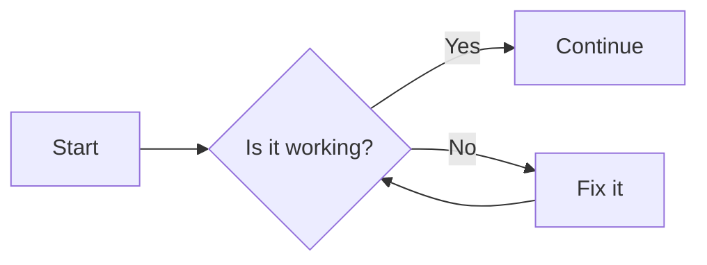
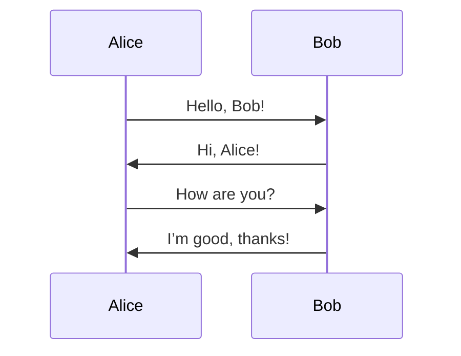
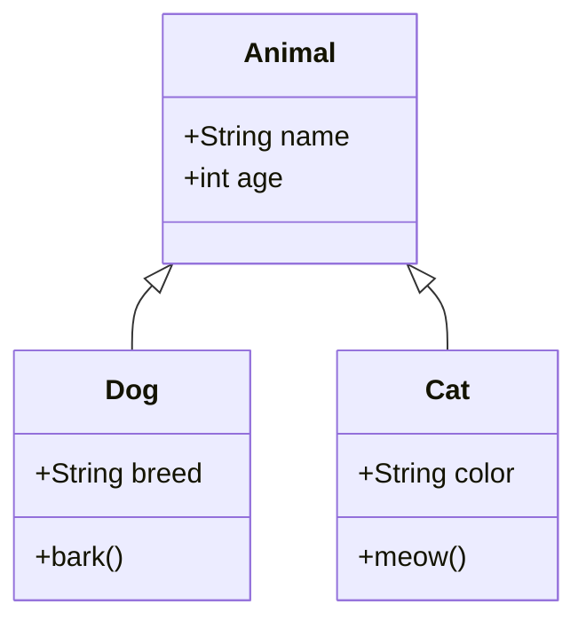
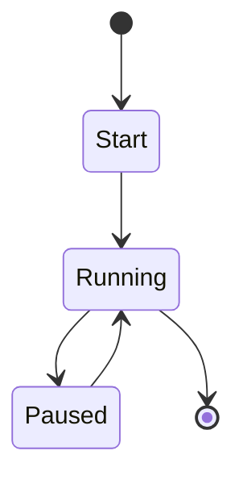
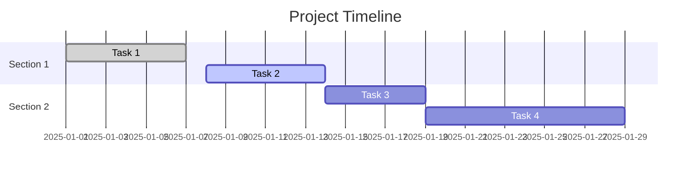
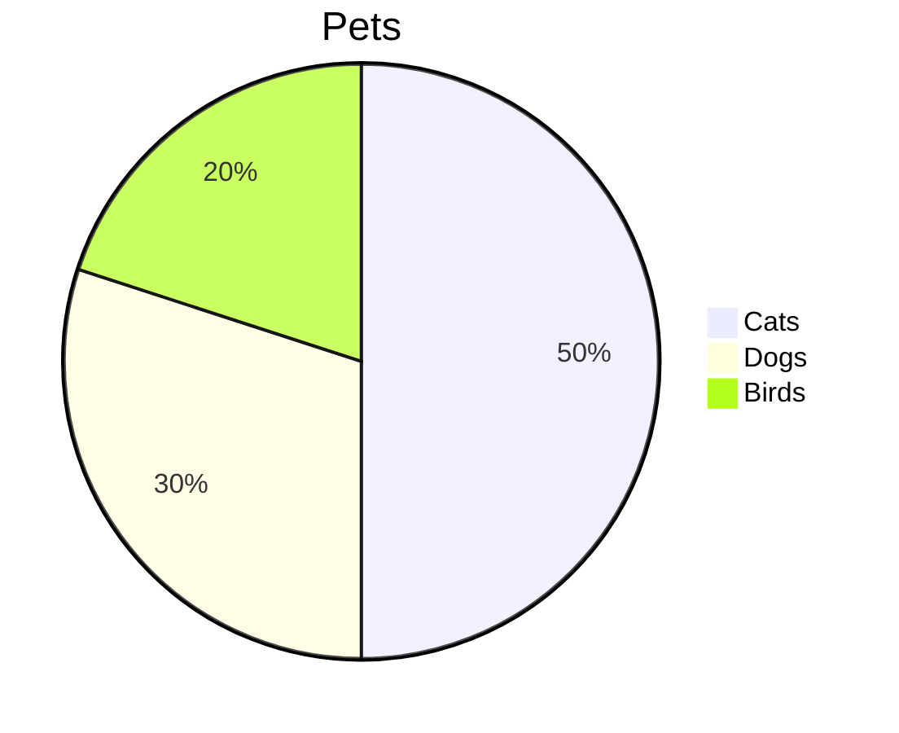
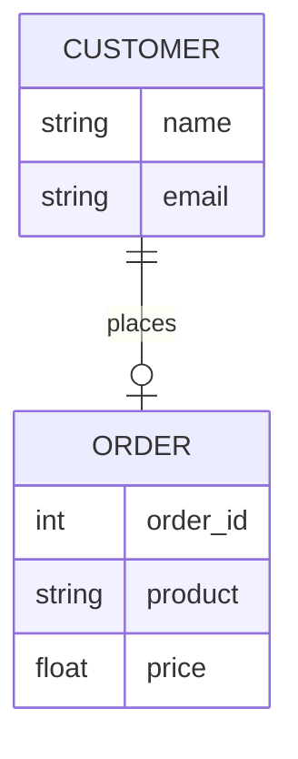
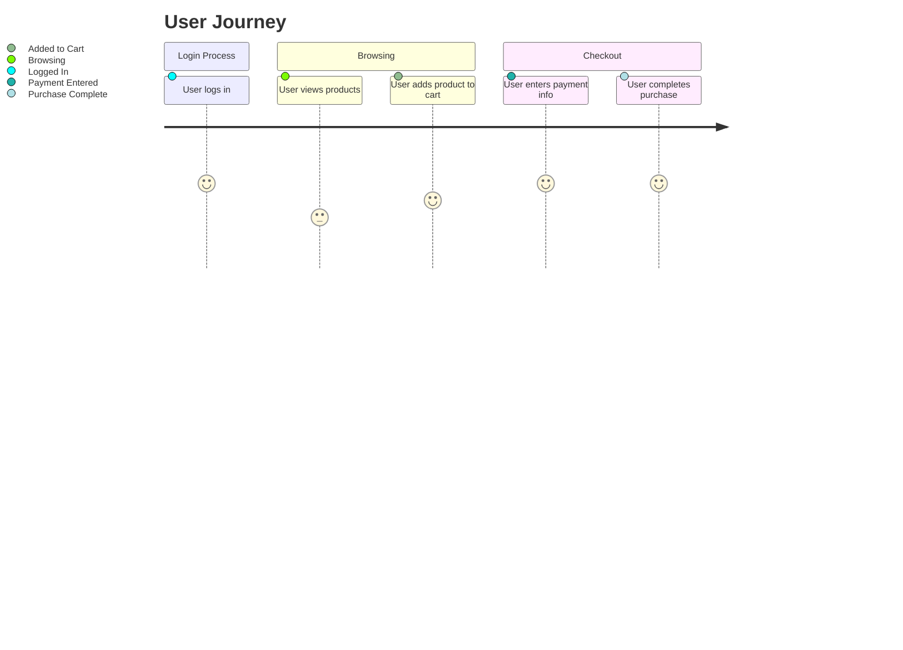
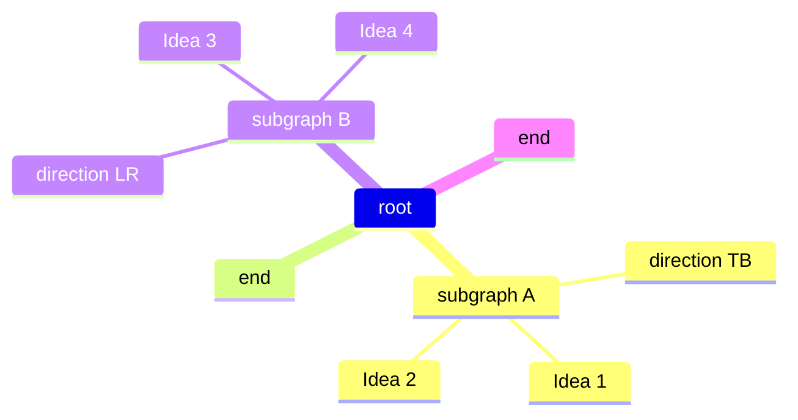

# Mermaid

Mermaid is a JavaScript based diagramming and charting tool that renders Markdown text into visual diagrams such as flow charts, gantt charts, DAGs, and other visualizations.

You need the `Markdown Preview Mermaid Support` Extension in VS Code in order to preview the diagrams being created.

### Flowchart

### Sequence

### Class

### State

### Gantt

### Pie Chart

### ERD

### User Journey

### Mind Map

