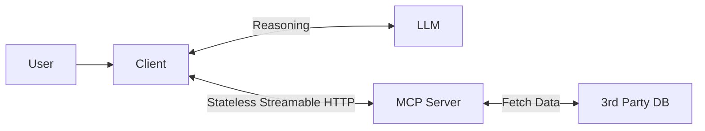

# MCP 2026-07-28 Server

This example uses MCP Python SDK v2, the sessionless `2026-07-28` protocol, and the Streamable HTTP transport. The same server can still answer older clients through the SDK's compatibility layer, with the legacy HTTP path configured as stateless.

## Run locally

```sh
uv sync --locked
uv run uvicorn server:app --host 127.0.0.1 --port 8000
```

In another terminal:

```sh
uv run client_example.py
```

The client uses `server/discover`, verifies that it negotiated `2026-07-28`, lists the server's tools, and calls `query_policy_docs` at `http://localhost:8000/mcp`.

## Run with Docker

```sh
docker build -t mcp-rag-server .
docker run --rm -p 8000:8000 mcp-rag-server
```

The default transport security accepts localhost hostnames. A remote deployment must configure an explicit host and origin allowlist, authentication, TLS termination, timeouts, and rate limits.


